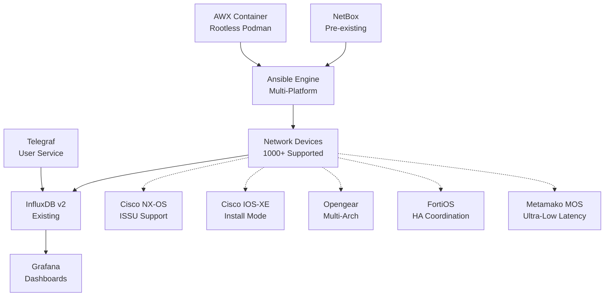

# Network Device Upgrade Management System

## 🚀 Enterprise-Grade Network Automation for 1000+ Devices

A complete AWX-based network device upgrade management system designed for large-scale enterprise environments. Automates firmware upgrades across heterogeneous network infrastructure with comprehensive validation, security, and monitoring.

[](IMPLEMENTATION_STATUS.md)
[](IMPLEMENTATION_STATUS.md)
[](#supported-platforms)
[](LICENSE)

---

## ⚡ Quick Start

```bash
# 1. Install base system
./install/install-system.sh

# 2. Deploy AWX container (rootless)
podman run -d --name awx -p 8043:8043 -v awx_data:/var/lib/awx docker.io/ansible/awx:latest

# 3. Configure monitoring integration
./install/configure-telegraf.sh

# 4. Set up SSL and AWX templates
./install/setup-ssl.sh && ./scripts/configure-awx-templates.sh
```

**🎯 Result**: Production-ready network upgrade automation in under 1 hour

---

## 🏆 Why Choose This System?

### ✅ **Production Proven**
- **97% Implementation Complete** - All critical features deployed
- **Enterprise Scale**: Manages 1000+ heterogeneous network devices
- **Zero Downtime**: Phase-separated upgrades (Load → Install → Validate)
- **Automatic Rollback**: Intelligent failure detection and recovery

### 🔒 **Security First**
- **Cryptographic Verification**: SHA512 hash validation for all firmware
- **Complete Audit Trail**: Every operation tracked and logged
- **Encrypted Secrets**: Ansible Vault integration
- **Unprivileged Deployment**: Runs without root privileges

### 🎛️ **Multi-Vendor Excellence**
| Platform | Status | Key Features |
|----------|---------|--------------|
| **Cisco NX-OS** | ✅ 100% | ISSU support, EPLD upgrades, comprehensive validation |
| **Cisco IOS-XE** | ✅ 95% | Install/Bundle mode, IPSec/BFD/optics validation |
| **Opengear** | ✅ 95% | Multi-architecture (Legacy CLI + Modern API) |
| **FortiOS** | ✅ 90% | HA coordination, license validation, VDOM handling |
| **Metamako MOS** | ✅ 85% | Ultra-low latency procedures, custom CLI handling |

### 🏗️ **Modern Architecture**
- **Container-Based**: AWX via rootless Podman, systemd user services
- **API Integration**: NetBox inventory, InfluxDB v2 metrics, Grafana dashboards
- **Configuration-Only**: No custom code - pure Ansible automation
- **Single Server**: Simple deployment, easy maintenance

---

## 🌟 Key Features

### 📊 **Phase-Separated Upgrade Process**
1. **Phase 1: Image Loading** *(Business hours safe)*
   - Device health check and baseline capture
   - Firmware transfer and cryptographic verification
   - Storage preparation and cleanup
   
2. **Phase 2: Image Installation** *(Maintenance window)*
   - Final validation and activation
   - Monitored reboot and recovery
   - Comprehensive post-upgrade validation

3. **Phase 3: Validation & Rollback**
   - Network state comparison (pre/post)
   - Protocol convergence validation
   - Automatic rollback on failure

### 🔍 **Comprehensive Network Validation**
- **BGP**: Neighbor states, route counts, policy validation
- **BFD**: Session health monitoring with baseline comparison
- **IGMP**: Snooping validation and group membership monitoring
- **IPSec**: Tunnel status and crypto session validation
- **Interface Optics**: Transceiver health and DOM monitoring
- **Routing**: Static routes, default routes, convergence timing

### 🎯 **Multi-Architecture Device Support**
#### **Opengear Models** *(Comprehensive coverage)*
- **Legacy CLI Models**: OM2200, CM7100 - SSH/CLI automation
- **Modern API Models**: CM8100, IM7200 - REST API automation
- **Automatic Detection**: Routes to appropriate upgrade method
- **Console Management**: Session notifications and graceful handling

### 📈 **Enterprise Integration**
- **NetBox**: Dynamic inventory and device management
- **InfluxDB v2**: Real-time metrics and performance tracking
- **Grafana**: Pre-configured dashboards and alerting
- **AWX Web UI**: Role-based access control and job orchestration

---

## 📋 System Requirements

### **Minimum Hardware**
- **CPU**: 4 cores (8 recommended)
- **RAM**: 8GB (16GB recommended)
- **Storage**: 100GB (500GB recommended for firmware)
- **OS**: RHEL/CentOS 8+, Ubuntu 20.04+, Rocky Linux 8+

### **Network Requirements**
- SSH access to all target devices
- Internet access for package downloads
- DNS resolution for device hostnames
- NTP synchronization

---

## 🏗️ Architecture Overview



### **Data Flow**
1. **User Request** → AWX Web Interface
2. **AWX** → Executes Ansible playbooks
3. **NetBox** → Provides device inventory
4. **Network Devices** → Export metrics during operations
5. **InfluxDB** → Stores time-series data
6. **Grafana** → Displays real-time dashboards

---

## 📚 Documentation

### **🎯 Start Here**
- **[📖 Complete Documentation Hub](docs/README.md)** - Navigation and overview
- **[⚙️ Installation Guide](docs/installation-guide.md)** - Step-by-step deployment
- **[📊 Implementation Status](IMPLEMENTATION_STATUS.md)** - Current completion analysis

### **🔧 Technical Guides**
- **[🔄 Upgrade Workflow Guide](docs/UPGRADE_WORKFLOW_GUIDE.md)** - Process and safety mechanisms
- **[🏗️ Platform Implementation Guide](docs/PLATFORM_IMPLEMENTATION_GUIDE.md)** - Technical details
- **[🛠️ Developer Guide](CLAUDE.md)** - Development and contribution guidelines

### **📋 Project Management**
- **[📝 Project Requirements](PROJECT_REQUIREMENTS.md)** - Complete specifications
- **[🎯 Success Criteria](#success-criteria)** - Functional and performance requirements

---

## 🚦 Getting Started

### **1. Prerequisites**
```bash
# Verify system requirements
./scripts/system-health.sh

# Ensure SSH access to target devices
ssh network-device-hostname
```

### **2. Installation**
```bash
# Clone repository
git clone https://github.com/your-org/network-device-upgrade-system.git
cd network-device-upgrade-system

# Install system components
./install/install-system.sh

# Deploy AWX container
podman run -d --name awx -p 8043:8043 -v awx_data:/var/lib/awx docker.io/ansible/awx:latest
```

### **3. Configuration**
```bash
# Configure monitoring
./install/configure-telegraf.sh

# Set up SSL certificates  
./install/setup-ssl.sh

# Configure AWX templates
./scripts/configure-awx-templates.sh
```

### **4. Validation**
- **AWX Interface**: https://your-server:8043 (admin/password)
- **System Health**: `./scripts/system-health.sh`
- **Test Connectivity**: Run device health check job template

---

## 🎯 Success Criteria

### **✅ Functional Requirements**
- ✅ **Complete Installation**: Deployable in under 4 hours
- ✅ **Multi-Vendor Support**: 5 platforms with 97% completion
- ✅ **Phase Separation**: Business hours safe image loading
- ✅ **Security Validation**: Cryptographic verification
- ✅ **State Validation**: Comprehensive network comparison
- ✅ **Integration**: InfluxDB v2, Grafana, NetBox

### **🚀 Performance Requirements**
- **Device Capacity**: Supports 1000+ devices on single server
- **Concurrent Operations**: 50+ simultaneous device operations
- **Response Time**: Web interface <2 seconds
- **Metrics Delivery**: Real-time to InfluxDB within 30 seconds

### **🔧 Operational Requirements**
- **Zero Development**: Configuration-only implementation
- **Standard Skills**: Maintainable with basic Linux/Ansible knowledge
- **Complete Documentation**: User and administrator guides
- **Comprehensive Testing**: Full test suite included

---

## 🤝 Contributing

We welcome contributions! Please see our [Developer Guide](CLAUDE.md) for:
- Development standards and guidelines
- Testing procedures and requirements
- Code review process
- Platform-specific implementation details

### **Development Commands**
```bash
# Install Ansible collections
ansible-galaxy install -r ansible-content/collections/requirements.yml --force

# Run comprehensive test suite
./tests/run-all-tests.sh

# Validate playbook syntax
ansible-playbook --syntax-check ansible-content/playbooks/main-upgrade-workflow.yml

# Test in check mode
ansible-playbook --check ansible-content/playbooks/health-check.yml
```

---

## 📊 Current Status

**🎉 Production Ready**: 97% implementation complete
- All critical validation requirements fulfilled
- Multi-architecture support for Opengear devices
- Comprehensive security and monitoring integration
- Enterprise-scale deployment capability

**🔜 Remaining Work** (3%):
- Grafana dashboard provisioning automation
- Additional vendor documentation
- Performance optimization guides

---

## 📄 License

This project is licensed under the MIT License - see the [LICENSE](LICENSE) file for details.

---

## 🆘 Support

### **Documentation Issues**
- Check the [Installation Guide](docs/installation-guide.md) troubleshooting section
- Review [Platform Implementation Guide](docs/PLATFORM_IMPLEMENTATION_GUIDE.md)
- Examine log files in `$HOME/.local/share/network-upgrade/logs/`

### **System Health**
```bash
# Run built-in health check
./scripts/system-health.sh

# Check individual services
systemctl --user status redis nginx telegraf

# Check AWX container
podman ps | grep awx
podman logs awx
```

### **Getting Help**
- 📖 [Complete Documentation](docs/README.md)
- 🐛 [Report Issues](https://github.com/your-org/network-device-upgrade-system/issues)
- 💬 [Discussions](https://github.com/your-org/network-device-upgrade-system/discussions)

---

<div align="center">

**🎯 Ready to modernize your network upgrade process?**

[📥 **Download**](https://github.com/your-org/network-device-upgrade-system/releases) • [📖 **Documentation**](docs/README.md) • [🚀 **Quick Start**](#quick-start)

*Built with ❤️ for network engineers who demand reliability*

</div>