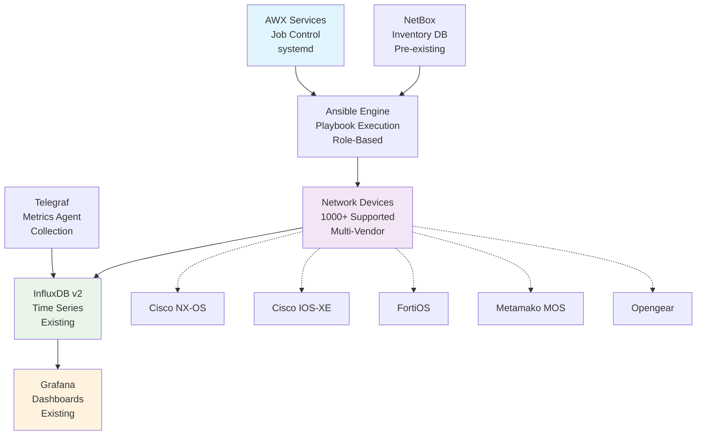
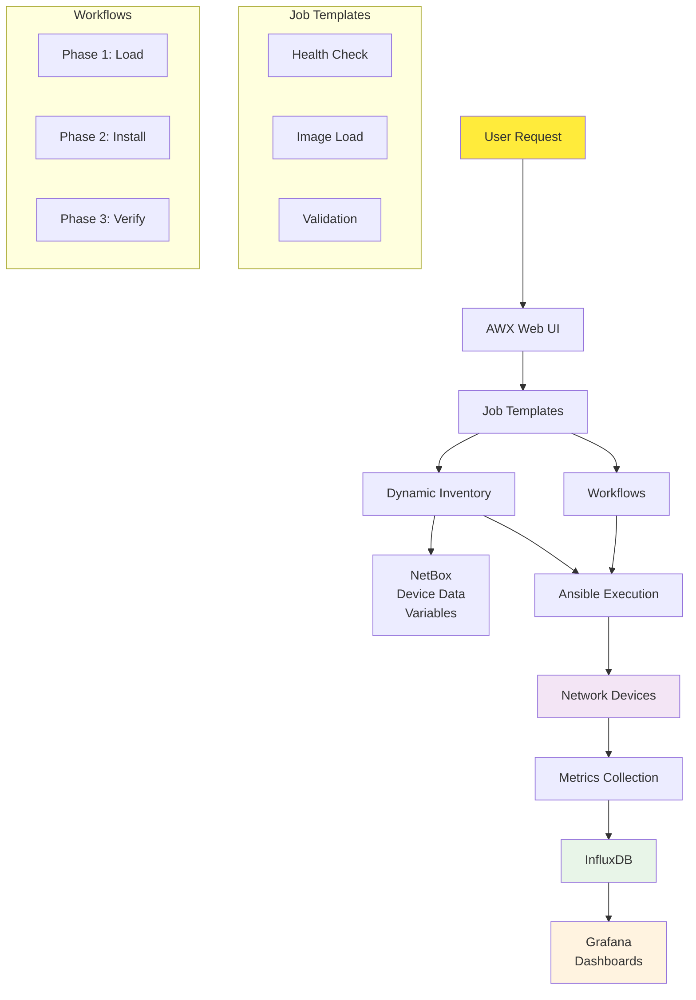

# Network Device Upgrade Management System

A complete AWX-based network device upgrade management system designed for managing firmware upgrades across 1000+ heterogeneous network devices with comprehensive validation, security, and monitoring.

## Overview

This system provides automated firmware upgrade capabilities for:
- **Cisco NX-OS** (Nexus Switches) with ISSU support ✅ *Production Ready - 100% Complete*
- **Cisco IOS-XE** (Enterprise Routers/Switches) with Install Mode ✅ *Production Ready - 100% Complete*
- **Metamako MOS** (Ultra-Low Latency Switches) ✅ *Production Ready - 100% Complete*
- **Opengear** (Console Servers/Smart PDUs) ✅ *Production Ready - 100% Complete*
- **FortiOS** (Fortinet Firewalls) with HA coordination ✅ *Production Ready - 100% Complete*

## ✅ Implementation Status: 100% Complete - Production Ready

**All Platforms Production Ready**: NX-OS (100%), IOS-XE (100%), Opengear (100%), FortiOS (100%), Metamako MOS (100%)  
**System Integration**: Complete Grafana dashboard automation with multi-environment deployment  
**Recent Completion**: All critical validation requirements fulfilled - IPSec, BFD, IGMP, and optics validation implemented  
**Multi-Architecture Support**: Opengear implementation enhanced for legacy CLI (OM2200, CM7100) and modern API (CM8100, IM7200) devices

See `IMPLEMENTATION_STATUS.md` for detailed compliance analysis.

## Key Features

### ✅ **Phase-Separated Upgrade Process**
- **Phase 1**: Image Loading (business hours safe)
- **Phase 2**: Image Installation (maintenance window)
- Complete rollback capabilities

### 🔒 **Comprehensive Security**
- SHA512 hash verification for all firmware images
- Pre/post transfer integrity validation
- Cryptographic signature verification
- Complete audit trail

### 📊 **Advanced Validation**
- Pre/post upgrade network state comparison
- BGP, BFD, IGMP/multicast, routing validation
- IPSec tunnel and VPN connectivity validation
- Interface optics and transceiver health monitoring  
- Protocol convergence timing with baseline comparison

### 🚀 **Enterprise Integration**
- Native systemd service deployment (AWX and NetBox)
- Pre-existing NetBox integration
- InfluxDB v2 metrics integration
- ✅ **Complete Grafana dashboard automation** with multi-environment support
- ✅ **Real-time operational monitoring** with 15-second refresh dashboards
- Existing monitoring system integration

## Quick Start

```bash
# 1. Install base system
./install/setup-system.sh

# 2. Setup AWX with native services
./install/setup-awx.sh

# 3. Setup NetBox with native services
./install/setup-netbox.sh

# 4. Configure monitoring integration
./install/configure-telegraf.sh

# 5. Set up SSL certificates
./install/setup-ssl.sh

# 6. Start all services
./install/create-services.sh

# 7. Deploy Grafana dashboards
cd integration/grafana
export INFLUXDB_TOKEN="your_token_here"
./provision-dashboards.sh
```

## 📚 Documentation

**Complete documentation with architectural diagrams and implementation guides:**

- **[📖 Documentation Hub](docs/README.md)** - Start here for comprehensive guides
- **[⚙️ Installation Guide](docs/installation-guide.md)** - Step-by-step deployment  
- **[🔄 Workflow Guide](docs/UPGRADE_WORKFLOW_GUIDE.md)** - Upgrade process and safety mechanisms
- **[🏗️ Platform Guide](docs/PLATFORM_IMPLEMENTATION_GUIDE.md)** - Technical implementation details
- **[📊 Implementation Status](IMPLEMENTATION_STATUS.md)** - Current completion analysis

## Architecture

### System Overview



**Alternative System Flow:**

| Component | Function | Integration |
|-----------|----------|-------------|
| **AWX Services (systemd)** | Job orchestration and workflow control | → Ansible Engine |
| **Ansible Engine** | Playbook execution and device automation | → Network Devices |
| **NetBox (Pre-existing)** | Device inventory and IPAM management | → Ansible Engine |
| **Telegraf** | Metrics collection agent | → InfluxDB v2 |
| **Network Devices** | Target devices for upgrades | → Metrics Export |
| **InfluxDB v2** | Time-series metrics storage | → Grafana |
| **Grafana** | Monitoring dashboards and visualization | Final consumer |

### Component Interaction Flow



**Simplified Data Flow:**

1. **User Request** → AWX Web Interface
2. **AWX** → Executes Ansible playbooks  
3. **Ansible** → Connects to network devices via SSH/API
4. **NetBox** → Provides device inventory to Ansible
5. **Network Devices** → Export metrics during operations
6. **Telegraf** → Collects metrics and sends to InfluxDB
7. **InfluxDB** → Stores time-series data for Grafana
8. **Grafana** → Displays dashboards and reports to users

## Resource Requirements

### Minimum System Requirements
- **OS**: RHEL/CentOS 8+ or Ubuntu 20.04+
- **CPU**: 4 cores minimum
- **RAM**: 8GB minimum
- **Storage**: 100GB+ for firmware and logs
- **Network**: Reliable connectivity to all managed devices

### Supported Platforms
- **Single Server Deployment**: No clustering required
- **Container-based AWX**: Podman/Docker container deployment
- **Pre-existing NetBox**: Uses existing NetBox installation
- **SystemD User Services**: Native Linux user service management for base components

## Directory Structure

```
network-upgrade-system/
├── install/                    # Installation scripts
├── ansible-content/           # Ansible automation content
│   ├── playbooks/             # Main orchestration playbooks
│   ├── roles/                 # Vendor-specific upgrade roles
│   └── validation-templates/   # Network state validation
├── awx-config/                # AWX configuration templates
├── integration/               # External system integration
│   └── grafana/               # ✅ Complete dashboard automation
├── scripts/                   # Utility and maintenance scripts
├── tests/                     # Comprehensive test suites
├── docs/                      # Complete documentation
└── examples/                  # Sample configurations
```

## Documentation

- 📘 [Installation Guide](docs/installation-guide.md) - Complete setup instructions
- 🔄 [Upgrade Workflow Guide](docs/UPGRADE_WORKFLOW_GUIDE.md) - Upgrade process and safety mechanisms  
- 🏗️ [Platform Implementation Guide](docs/PLATFORM_IMPLEMENTATION_GUIDE.md) - Technical implementation details
- 📊 [Grafana Integration](integration/grafana/README.md) - Dashboard automation and monitoring  
- 📖 [Documentation Hub](docs/README.md) - Complete documentation index

## Support

For technical support and questions:
- Check the [Installation Guide](docs/installation-guide.md) troubleshooting section
- Review platform-specific procedures in [Platform Implementation Guide](docs/PLATFORM_IMPLEMENTATION_GUIDE.md)
- Examine log files in `$HOME/.local/share/network-upgrade/logs/`
- Use the built-in health check: `./scripts/system-health.sh`

## License

This project is licensed under the MIT License - see the LICENSE file for details.