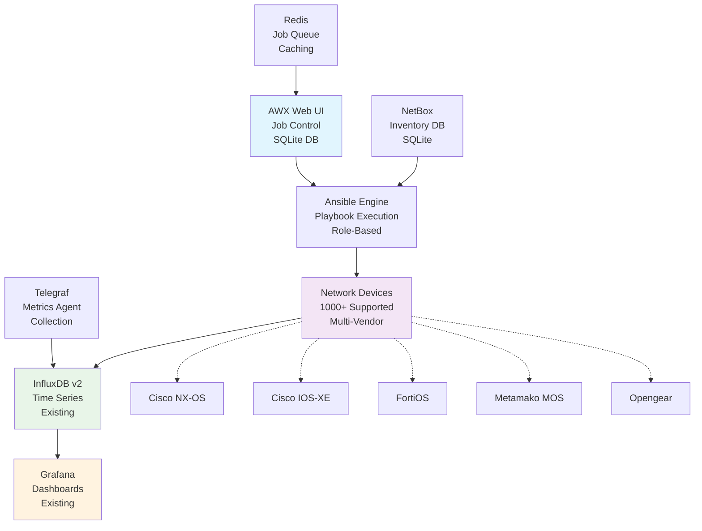
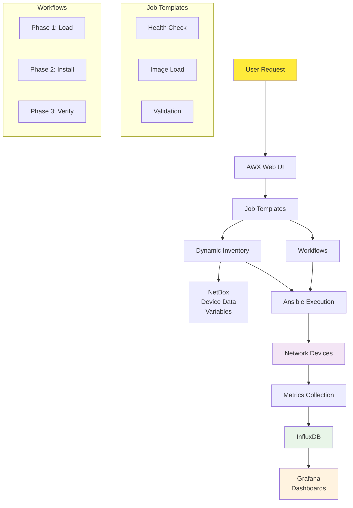

# Network Device Upgrade Management System

A complete AWX-based network device upgrade management system designed for managing firmware upgrades across 1000+ heterogeneous network devices with comprehensive validation, security, and monitoring.

## Overview

This system provides automated firmware upgrade capabilities for:
- **Cisco NX-OS** (Nexus Switches) with ISSU support ✅ *Production Ready*
- **Cisco IOS-XE** (Enterprise Routers/Switches) with Install Mode ⚠️ *Validation Incomplete*
- **Metamako MOS** (Ultra-Low Latency Switches) ✅ *Production Ready*
- **Opengear** (Console Servers/Smart PDUs) ✅ *Production Ready*
- **FortiOS** (Fortinet Firewalls) with HA coordination ✅ *Production Ready*

## 🚧 Implementation Status: 85% Complete

**Production Ready Platforms**: NX-OS, FortiOS, Metamako MOS, Opengear  
**In Development**: IOS-XE platform requires completion of IPSec, BFD, and optics validation

See `IMPLEMENTATION_STATUS.md` for detailed compliance analysis.

## Key Features

### ✅ **Phase-Separated Upgrade Process**
- **Phase 1**: Image Loading (business hours safe)
- **Phase 2**: Image Installation (maintenance window)
- Complete rollback capabilities

### 🔒 **Comprehensive Security**
- SHA512 hash verification for all firmware images
- Pre/post transfer integrity validation
- Cryptographic signature verification
- Complete audit trail

### 📊 **Advanced Validation**
- Pre/post upgrade network state comparison
- BGP, BFD, multicast, routing validation
- Interface and optics state monitoring
- Protocol convergence timing

### 🚀 **Enterprise Integration**
- SQLite backend (single server deployment)
- InfluxDB v2 metrics integration
- Grafana dashboard provisioning
- Existing monitoring system integration

## Quick Start

```bash
# 1. Install base system
sudo ./install/install-system.sh

# 2. Install AWX with SQLite backend
sudo ./install/install-awx.sh

# 3. Install NetBox with SQLite backend  
sudo ./install/install-netbox.sh

# 4. Configure monitoring integration
sudo ./install/configure-telegraf.sh

# 5. Set up SSL certificates
sudo ./install/setup-ssl.sh

# 6. Create system services
sudo ./install/create-services.sh

# 7. Configure AWX templates
./scripts/configure-awx-templates.sh
```

## 📚 Documentation

**Complete documentation with architectural diagrams and implementation guides:**

- **[📖 Documentation Hub](docs/README.md)** - Start here for comprehensive guides
- **[⚙️ Installation Guide](docs/installation-guide.md)** - Step-by-step deployment  
- **[🔄 Workflow Guide](docs/UPGRADE_WORKFLOW_GUIDE.md)** - Upgrade process and safety mechanisms
- **[🏗️ Platform Guide](docs/PLATFORM_IMPLEMENTATION_GUIDE.md)** - Technical implementation details
- **[📊 Implementation Status](IMPLEMENTATION_STATUS.md)** - Current completion analysis

## Architecture

### System Overview



**Alternative ASCII View:**
```
┌──────────────┐    ┌──────────────┐    ┌──────────────┐
│   AWX Web    │───▶│   Ansible    │───▶│   Network    │
│   (SQLite)   │    │   Engine     │    │   Devices    │
└──────────────┘    └──────────────┘    └──────────────┘
       │                     │                 │
       ▼                     ▼                 ▼
┌──────────────┐    ┌──────────────┐    ┌──────────────┐
│   NetBox     │    │  Telegraf    │    │  Metrics     │
│ (Inventory)  │    │ (Metrics)    │    │  Export      │
└──────────────┘    └──────────────┘    └──────────────┘
       │                     │                 │
       └─────────────────────┼─────────────────┘
                             ▼
                    ┌──────────────┐
                    │  InfluxDB v2 │
                    │   Grafana    │
                    └──────────────┘
```

### Component Interaction Flow



**Simplified Flow:**
```
User ──▶ AWX ──▶ Ansible ──▶ Network Devices
  │        │         │             │
  │        ▼         ▼             ▼
  │     NetBox ◀─ Inventory   Metrics Export
  │        │                       │
  │        ▼                       ▼
  └──▶ Reports ◀─── InfluxDB ◀── Grafana
```

## Resource Requirements

### Minimum System Requirements
- **OS**: RHEL/CentOS 8+ or Ubuntu 20.04+
- **CPU**: 4 cores minimum
- **RAM**: 8GB minimum
- **Storage**: 100GB+ for firmware and logs
- **Network**: Reliable connectivity to all managed devices

### Supported Platforms
- **Single Server Deployment**: No clustering required
- **SQLite Backend**: Lightweight database with no external dependencies
- **SystemD Services**: Native Linux service management
- **Container Support**: Optional Docker deployment available

## Directory Structure

```
network-upgrade-system/
├── install/                    # Installation scripts
├── ansible-content/           # Ansible automation content
│   ├── playbooks/             # Main orchestration playbooks
│   ├── roles/                 # Vendor-specific upgrade roles
│   └── validation-templates/   # Network state validation
├── awx-config/                # AWX configuration templates
├── integration/               # External system integration
├── scripts/                   # Utility and maintenance scripts
├── tests/                     # Comprehensive test suites
├── docs/                      # Complete documentation
└── examples/                  # Sample configurations
```

## Documentation

- 📘 [Installation Guide](docs/installation-guide.md) - Complete setup instructions
- 👥 [User Guide](docs/user-guide.md) - AWX web interface usage
- 🔧 [Administrator Guide](docs/administrator-guide.md) - System administration
- 🛠 [Vendor Guides](docs/vendor-guides/) - Platform-specific procedures
- 🔗 [Integration Guide](docs/integration-guide.md) - External system integration
- 🔐 [Security Guide](docs/security-guide.md) - Security procedures
- 🚨 [Troubleshooting](docs/troubleshooting.md) - Common issues and solutions

## Support

For technical support and questions:
- Check the [troubleshooting guide](docs/troubleshooting.md)
- Review [vendor-specific procedures](docs/vendor-guides/)
- Examine log files in `/var/log/network-upgrade/`
- Use the built-in health check: `./scripts/system-health.sh`

## License

This project is licensed under the MIT License - see the LICENSE file for details.