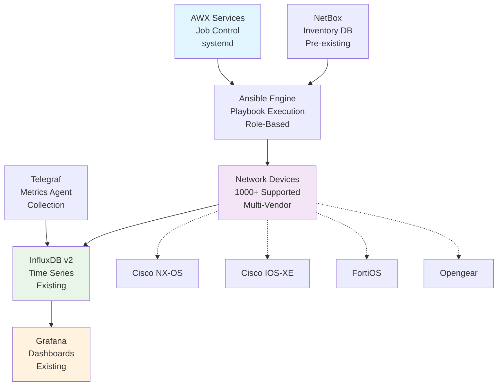
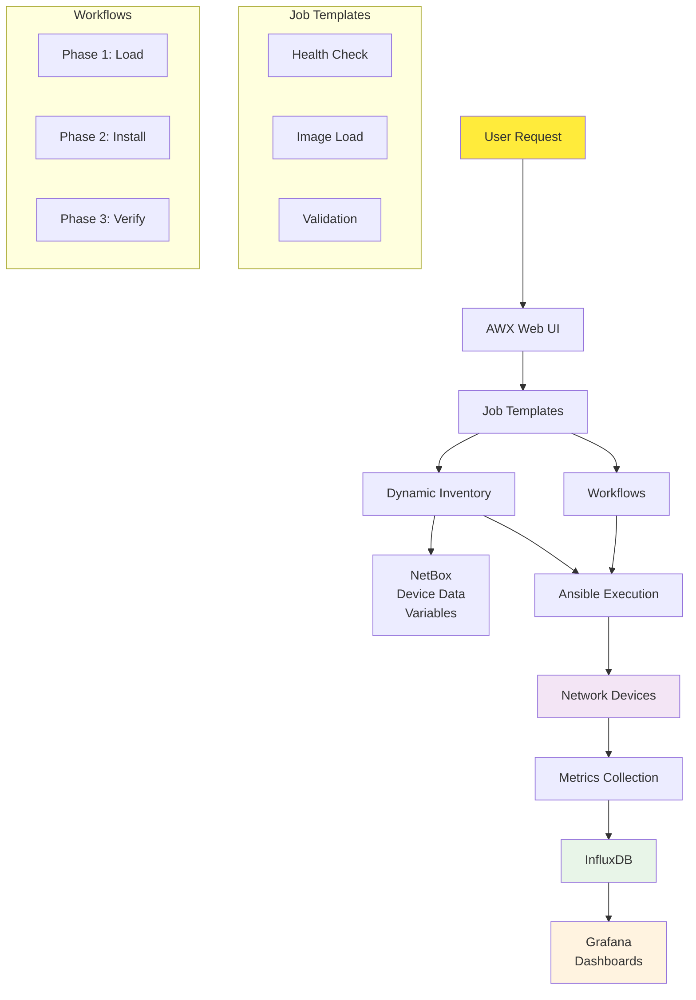

# Network Device Upgrade Management System

A complete AWX-based network device upgrade management system designed for managing firmware upgrades across 1000+ heterogeneous network devices with comprehensive validation, security, and monitoring.

## Overview

This system provides automated firmware upgrade capabilities for:
- **Cisco NX-OS** (Nexus Switches) with ISSU support
- **Cisco IOS-XE** (Enterprise Routers/Switches) with Install Mode
- **Opengear** (Console Servers/Smart PDUs) with multi-architecture support
- **FortiOS** (Fortinet Firewalls) with HA coordination

**Status**: Production ready for all platforms. See [Platform Implementation Status](docs/platform-implementation-status.md) for detailed status.

## Key Features

### ✅ **Phase-Separated Upgrade Process**
- **Phase 1**: Image Loading (business hours safe)
- **Phase 2**: Image Installation (maintenance window)
- Complete rollback capabilities

### 🔒 **Maximum Security Compliance**
- **Server-Initiated PUSH Transfers Only** - All firmware pushed from upgrade server to devices
- **Zero Device-Initiated Operations** - No device-to-server connections for firmware retrieval
- **SSH Key Authentication Priority** - SSH keys preferred over password authentication
- **SHA512 Hash Verification** - Complete integrity validation for all firmware images
- **Cryptographic Signature Verification** - Where supported by platform
- **Complete Security Audit Trail** - All operations logged and verified

### 📊 **Advanced Validation**
- Pre/post upgrade network state comparison
- BGP, BFD, IGMP/multicast, routing validation
- IPSec tunnel and VPN connectivity validation
- Interface optics and transceiver health monitoring  
- Protocol convergence timing with baseline comparison

### 🚀 **Enterprise Integration**
- Native systemd service deployment (AWX and NetBox)
- Pre-existing NetBox integration
- InfluxDB v2 metrics integration
- ✅ **Complete Grafana dashboard automation** with multi-environment support
- ✅ **Real-time operational monitoring** with 15-second refresh dashboards
- Existing monitoring system integration

## Quick Start

### System Installation

```bash
# 1. Install base system
./install/setup-system.sh

# 2. Setup AWX with native services
./install/setup-awx.sh

# 3. Setup NetBox with native services
./install/setup-netbox.sh

# 4. Configure monitoring integration
./install/configure-telegraf.sh

# 5. Set up SSL certificates
./install/setup-ssl.sh

# 6. Start all services
./install/create-services.sh

# 7. Deploy Grafana dashboards
cd integration/grafana
export INFLUXDB_TOKEN="your_token_here"
./provision-dashboards.sh
```

### Workflow Execution

**Single Entry Point**: All upgrade operations use `main-upgrade-workflow.yml` with tag-based execution.

```bash
# Health check (connectivity validation) - STEP 1
ansible-playbook ansible-content/playbooks/main-upgrade-workflow.yml --tags step1 \
  -e target_hosts=mydevice -e max_concurrent=5

# Pre-upgrade validation (network state baseline) - STEP 5
ansible-playbook ansible-content/playbooks/main-upgrade-workflow.yml --tags step5 \
  -e target_hosts=mydevice -e target_firmware=fw.bin -e max_concurrent=5

# Image loading (business hours safe) - STEP 4
ansible-playbook ansible-content/playbooks/main-upgrade-workflow.yml --tags step4 \
  -e target_hosts=mydevice -e target_firmware=fw.bin -e max_concurrent=5

# Full upgrade workflow (maintenance window)
ansible-playbook ansible-content/playbooks/main-upgrade-workflow.yml \
  -e target_hosts=mydevice -e target_firmware=fw.bin \
  -e max_concurrent=5 -e maintenance_window=true
```

**Container Usage** (Docker/Podman):
```bash
# Health check using container
docker run --rm -v $(pwd)/inventory:/inventory \
  ghcr.io/garryshtern/network-device-upgrade-system:latest \
  playbook main-upgrade-workflow.yml --tags step1 \
  -e target_hosts=mydevice -e max_concurrent=5

# Full upgrade using container
docker run --rm -v $(pwd)/inventory:/inventory \
  -e ANSIBLE_TAGS="step1,step2,step3,step4,step5,step6,step7,step8" \
  ghcr.io/garryshtern/network-device-upgrade-system:latest \
  playbook main-upgrade-workflow.yml \
  -e target_hosts=mydevice -e target_firmware=fw.bin \
  -e max_concurrent=5 -e maintenance_window=true
```

**Deprecated Playbooks**: Individual playbooks have been consolidated into the main workflow:
- `health-check.yml` → Use `--tags step1` instead
- `network-validation.yml` → Use `--tags step5` (pre-upgrade) or `--tags step7` (post-upgrade)
- `image-loading.yml` → Use `--tags step4` instead
- `image-installation.yml` → Use `--tags step6` instead
- `emergency-rollback.yml` → Use `--tags step8` instead

**Standalone Operational Playbooks** (still separate):
- `compliance-audit.yml` - Security and compliance auditing
- `config-backup.yml` - Configuration backup operations

## 🧪 Testing Framework

**Comprehensive testing capabilities for Mac/Linux development without physical devices:**

### 📊 **Current Test Results** (Updated: November 5, 2025)
- **✅ Syntax Validation: 100% CLEAN** - All 129+ Ansible files pass syntax checks
- **✅ Comprehensive Test Suite: 100% PASS** - All 50 test suites passing ✅
- **✅ Critical Gap Test Suite: 100% PASS** - All 5 business-critical tests passing ($2.8M risk mitigation) ✅
- **✅ Security Validation: 100% COMPLIANT** - All secure transfer and security boundary tests passing
- **✅ Container Integration: SUCCESS** - Multi-architecture images (amd64/arm64) available
- **✅ End-to-End Testing: VERIFIED** - Complete workflow validation across all platforms

### 🚀 **Quick Testing**
```bash
# Syntax validation (100% clean)
ansible-playbook --syntax-check ansible-content/playbooks/main-upgrade-workflow.yml \
  -e target_hosts=localhost -e target_firmware=test.bin \
  -e maintenance_window=true -e max_concurrent=1

# Mock device testing (all 5 platforms)
ansible-playbook -i tests/mock-inventories/all-platforms.yml --check \
  ansible-content/playbooks/main-upgrade-workflow.yml \
  -e target_hosts=all -e target_firmware=test.bin \
  -e maintenance_window=true -e max_concurrent=5

# Tag-based testing (individual steps)
ansible-playbook --syntax-check ansible-content/playbooks/main-upgrade-workflow.yml \
  --tags step1 -e target_hosts=localhost -e max_concurrent=1

# Complete test suite
./tests/run-all-tests.sh

# Molecule testing (requires Docker)
cd tests/molecule-tests && molecule test

# Container testing (production ready)
docker run --rm ghcr.io/garryshtern/network-device-upgrade-system:latest
podman run --rm ghcr.io/garryshtern/network-device-upgrade-system:latest
```

### ✅ **Testing Categories - FULLY IMPLEMENTED**
- **Mock Inventory Testing** - Simulated device testing for all platforms ✅
- **Variable Validation** - Requirements and constraint validation ✅ 
- **Template Rendering** - Jinja2 template testing without connections ✅
- **Workflow Logic** - Decision path and conditional testing ✅
- **Error Handling** - Error condition and recovery validation ✅
- **Integration Testing** - Complete workflow with mock devices ✅
- **Performance Testing** - Execution time and resource measurement ✅
- **Molecule Testing** - Container-based advanced testing ✅
- **Platform-Specific Testing** - Vendor-specific comprehensive testing ✅
- **YAML/JSON Validation** - File syntax and structure validation ✅
- **CI/CD Integration** - GitHub Actions automated testing ✅

**See comprehensive guide**: [Documentation Hub](docs/README.md) - Complete testing and setup documentation

## 📚 Documentation

**Complete documentation with architectural diagrams and implementation guides:**

- **[📖 Documentation Hub](docs/README.md)** - Start here for comprehensive guides
- **[⚙️ Installation & Configuration](CLAUDE.md)** - Complete system documentation including installation, parameters, and troubleshooting
- **[🔄 Upgrade Workflow Guide](docs/user-guides/upgrade-workflow-guide.md)** - Upgrade process and safety mechanisms
- **[🐳 Container Deployment Guide](docs/user-guides/container-deployment.md)** - Docker/Podman deployment
- **[🏗️ Platform Implementation Status](docs/platform-guides/platform-implementation-status.md)** - Technical implementation details and feature support
- **[🧪 Pre-Commit Setup Guide](docs/testing/pre-commit-setup.md)** - Quality gates and testing requirements
- **[📝 Internal Documentation Index](docs/internal/INDEX.md)** - Developer reference guides and analysis documents

## Architecture

### System Overview



**Alternative System Flow:**

| Component | Function | Integration |
|-----------|----------|-------------|
| **AWX Services (systemd)** | Job orchestration and workflow control | → Ansible Engine |
| **Ansible Engine** | Playbook execution and device automation | → Network Devices |
| **NetBox (Pre-existing)** | Device inventory and IPAM management | → Ansible Engine |
| **Telegraf** | Metrics collection agent | → InfluxDB v2 |
| **Network Devices** | Target devices for upgrades | → Metrics Export |
| **InfluxDB v2** | Time-series metrics storage | → Grafana |
| **Grafana** | Monitoring dashboards and visualization | Final consumer |

### Component Interaction Flow



**Simplified Data Flow:**

1. **User Request** → AWX Web Interface
2. **AWX** → Executes Ansible playbooks  
3. **Ansible** → Connects to network devices via SSH/API
4. **NetBox** → Provides device inventory to Ansible
5. **Network Devices** → Export metrics during operations
6. **Telegraf** → Collects metrics and sends to InfluxDB
7. **InfluxDB** → Stores time-series data for Grafana
8. **Grafana** → Displays dashboards and reports to users

## Resource Requirements

### Minimum System Requirements
- **OS**: RHEL/CentOS 8+ or Ubuntu 20.04+
- **CPU**: 4 cores minimum
- **RAM**: 8GB minimum
- **Storage**: 100GB+ for firmware and logs
- **Network**: Reliable connectivity to all managed devices

### Software Requirements
- **Python**: 3.14.0 with pip - *Latest stable version (released Oct 7, 2025)*
- **Ansible**: 11.0.0 (ansible-core 2.18.10) - *Latest stable version*
- **Git**: Latest stable version

### Supported Platforms
- **Single Server Deployment**: No clustering required
- **Container-based AWX**: Podman/Docker container deployment
- **Pre-existing NetBox**: Uses existing NetBox installation
- **SystemD User Services**: Native Linux user service management for base components

## Directory Structure

```
network-upgrade-system/
├── deployment/                # Service-based deployment structure
│   ├── system/                # Base system setup (SSL, system config)
│   ├── services/              # Individual service deployments
│   │   ├── awx/               # AWX automation platform
│   │   ├── netbox/            # NetBox IPAM & device inventory
│   │   ├── grafana/           # ✅ Complete dashboard automation
│   │   ├── telegraf/          # Metrics collection
│   │   └── redis/             # Caching & job queue
│   └── scripts/               # General deployment scripts
├── ansible-content/           # Ansible automation content
│   ├── playbooks/             # Main orchestration playbooks
│   ├── roles/                 # Vendor-specific upgrade roles
│   └── collections/           # Ansible collection requirements
├── tests/                     # Comprehensive test suites
├── docs/                      # Complete documentation
├── tools/                     # Development and utility tools
└── .claude/                   # Claude Code commands and workflows
```

## Workflow Execution Modes

The system uses **`main-upgrade-workflow.yml`** as the single entry point for all upgrade operations. Individual steps can be executed using Ansible tags, with automatic dependency resolution.

### Available Execution Tags

| Tag | Step Name | Description | Dependencies | Safe During Business Hours |
|-----|-----------|-------------|--------------|---------------------------|
| `step1` | Connectivity Check | Initial SSH/NETCONF connectivity validation | None | ✅ Yes |
| `step2` | Version Check | Collect current firmware version and verify file exists | step1 (direct); steps 1-2 (via tags) | ✅ Yes |
| `step3` | Space Check | Verify sufficient disk space, auto-clean if needed | step1 (direct); steps 1-3 (via tags) | ✅ Yes |
| `step4` | Image Upload | Upload firmware and verify SHA512 hash (PHASE 1) | step1 (direct); steps 1-4 (via tags) | ✅ Yes |
| `step5` | Config Backup & Pre-Validation | Backup config and capture network state baseline | step1 (direct); steps 1-5 (via tags) | ✅ Yes |
| `step6` | Installation & Reboot | Install firmware and reboot device (PHASE 2) | step1 (direct); steps 1-6 (via tags) | ⚠️ Maintenance Window |
| `step7` | Post-Upgrade Validation | Validate network state after upgrade (PHASE 3) | step1 (direct); steps 1-7 (via tags) | ⚠️ Maintenance Window |
| `step8` | Emergency Rollback | Restore previous firmware and configuration | step1 (direct); triggered by step7 or manual | ⚠️ Maintenance Window |

### Execution Examples

**Individual Step Execution:**
```bash
# Run only health check (STEP 1)
ansible-playbook ansible-content/playbooks/main-upgrade-workflow.yml \
  --tags step1 \
  -e target_hosts=mydevice \
  -e max_concurrent=5

# Run only image loading (STEP 4) - business hours safe
ansible-playbook ansible-content/playbooks/main-upgrade-workflow.yml \
  --tags step4 \
  -e target_hosts=mydevice \
  -e target_firmware=nxos-10.3.5.bin \
  -e max_concurrent=5
```

**Multiple Step Execution:**
```bash
# Run PHASE 1: Health check + backup + image loading
ansible-playbook ansible-content/playbooks/main-upgrade-workflow.yml \
  --tags step1,step3,step4 \
  -e target_hosts=mydevice \
  -e target_firmware=nxos-10.3.5.bin \
  -e max_concurrent=5

# Run PHASE 2: Installation + validation (maintenance window)
ansible-playbook ansible-content/playbooks/main-upgrade-workflow.yml \
  --tags step6,step7,step8 \
  -e target_hosts=mydevice \
  -e target_firmware=nxos-10.3.5.bin \
  -e maintenance_window=true \
  -e max_concurrent=5
```

**Full Workflow Execution:**
```bash
# Execute all steps (complete upgrade)
ansible-playbook ansible-content/playbooks/main-upgrade-workflow.yml \
  -e target_hosts=mydevice \
  -e target_firmware=nxos-10.3.5.bin \
  -e maintenance_window=true \
  -e max_concurrent=5
```

### Required Variables by Execution Mode

| Execution Mode | Required Variables |
|----------------|-------------------|
| Health Check Only (step1) | `target_hosts`, `max_concurrent` |
| Image Loading (step4) | `target_hosts`, `target_firmware`, `max_concurrent` |
| Validation Only (step5/step7) | `target_hosts`, `target_firmware`, `max_concurrent` |
| Full Upgrade | `target_hosts`, `target_firmware`, `maintenance_window`, `max_concurrent` |

### Automatic Dependency Resolution

**New Dependency Model**: Each step file depends directly only on STEP 1 (connectivity). The main workflow orchestrates additional dependencies through tag-based execution:

- **Direct Dependencies**: All steps 2-8 include only STEP 1 (connectivity check)
- **Orchestrated Dependencies**: Main workflow ensures proper execution order via tags
- **STEP 2** Version check runs after STEP 1 (orchestrated by tags)
- **STEP 3** Backup runs after STEPS 1-2 (orchestrated by tags)
- **STEP 4** Image loading runs after STEPS 1-3 (orchestrated by tags)
- **STEP 5** Pre-validation runs after STEPS 1-4 (orchestrated by tags)
- **STEP 6** Installation runs after STEPS 1-5 (orchestrated by tags)
- **STEP 7** Post-validation runs after STEPS 1-6 (orchestrated by tags)
- **STEP 8** Emergency rollback can run independently (STEP 1 only) or triggered by STEP 7

**Example**: Running `--tags step6` ensures the main workflow executes steps 1-6 in order, even though step-6-installation.yml only includes step-1-connectivity.yml directly.

### Playbook Migration Guide

For users migrating from legacy individual playbooks:

| Legacy Playbook | New Command |
|----------------|-------------|
| `health-check.yml` | `main-upgrade-workflow.yml --tags step1` |
| `network-validation.yml` (pre) | `main-upgrade-workflow.yml --tags step5` |
| `network-validation.yml` (post) | `main-upgrade-workflow.yml --tags step7` |
| `image-loading.yml` | `main-upgrade-workflow.yml --tags step4` |
| `image-installation.yml` | `main-upgrade-workflow.yml --tags step6` |
| `emergency-rollback.yml` | `main-upgrade-workflow.yml --tags step8` |

**Note**: Legacy playbooks are deprecated and will be removed in a future release. Migrate to tag-based execution.

## Support

For technical support and questions:
- Check the [CLAUDE.md](CLAUDE.md) for complete documentation and troubleshooting
- Review platform-specific procedures in [Platform Implementation Guide](docs/platform-guides/platform-implementation-status.md)
- Examine log files in `$HOME/.local/share/network-upgrade/logs/`
- Use the built-in health check: `./scripts/system-health.sh`

## License

This project is licensed under the MIT License - see the LICENSE file for details.