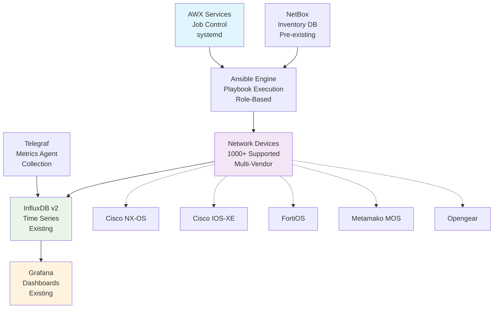
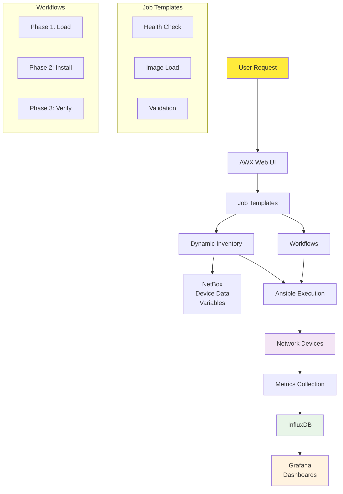

# Network Device Upgrade Management System

A complete AWX-based network device upgrade management system designed for managing firmware upgrades across 1000+ heterogeneous network devices with comprehensive validation, security, and monitoring.

## Overview

This system provides automated firmware upgrade capabilities for:
- **Cisco NX-OS** (Nexus Switches) with ISSU support
- **Cisco IOS-XE** (Enterprise Routers/Switches) with Install Mode  
- **Metamako MOS** (Ultra-Low Latency Switches) with Application Management
- **Opengear** (Console Servers/Smart PDUs) with multi-architecture support
- **FortiOS** (Fortinet Firewalls) with HA coordination

**Status**: Production ready for all platforms. See [IMPLEMENTATION_STATUS.md](docs/IMPLEMENTATION_STATUS.md) for detailed status.

## Key Features

### ✅ **Phase-Separated Upgrade Process**
- **Phase 1**: Image Loading (business hours safe)
- **Phase 2**: Image Installation (maintenance window)
- Complete rollback capabilities

### 🔒 **Maximum Security Compliance**
- **Server-Initiated PUSH Transfers Only** - All firmware pushed from upgrade server to devices
- **Zero Device-Initiated Operations** - No device-to-server connections for firmware retrieval
- **SSH Key Authentication Priority** - SSH keys preferred over password authentication
- **SHA512 Hash Verification** - Complete integrity validation for all firmware images
- **Cryptographic Signature Verification** - Where supported by platform
- **Complete Security Audit Trail** - All operations logged and verified

### 📊 **Advanced Validation**
- Pre/post upgrade network state comparison
- BGP, BFD, IGMP/multicast, routing validation
- IPSec tunnel and VPN connectivity validation
- Interface optics and transceiver health monitoring  
- Protocol convergence timing with baseline comparison

### 🚀 **Enterprise Integration**
- Native systemd service deployment (AWX and NetBox)
- Pre-existing NetBox integration
- InfluxDB v2 metrics integration
- ✅ **Complete Grafana dashboard automation** with multi-environment support
- ✅ **Real-time operational monitoring** with 15-second refresh dashboards
- Existing monitoring system integration

## Quick Start

```bash
# 1. Install base system
./install/setup-system.sh

# 2. Setup AWX with native services
./install/setup-awx.sh

# 3. Setup NetBox with native services
./install/setup-netbox.sh

# 4. Configure monitoring integration
./install/configure-telegraf.sh

# 5. Set up SSL certificates
./install/setup-ssl.sh

# 6. Start all services
./install/create-services.sh

# 7. Deploy Grafana dashboards
cd integration/grafana
export INFLUXDB_TOKEN="your_token_here"
./provision-dashboards.sh
```

## 🧪 Testing Framework

**Comprehensive testing capabilities for Mac/Linux development without physical devices:**

### 📊 **Current Test Results** (Updated: September 15, 2025)
- **✅ Syntax Validation: 100% CLEAN** - All 69+ Ansible files pass syntax checks
- **✅ Security Validation: 100% COMPLIANT** - All secure transfer tests pass (10/10)
- **✅ Test Suite Pass Rate: 100%** - All 14 test suites passing cleanly ✅
- **✅ Container Integration: SUCCESS** - Multi-architecture images (amd64/arm64) available
- **✅ Molecule Testing: 5/9 ROLES** - Critical roles configured with Docker testing

### 🚀 **Quick Testing**
```bash
# Syntax validation (100% clean)
ansible-playbook --syntax-check ansible-content/playbooks/main-upgrade-workflow.yml

# Mock device testing (all 5 platforms)
ansible-playbook -i tests/mock-inventories/all-platforms.yml --check \
  ansible-content/playbooks/main-upgrade-workflow.yml

# Complete test suite
./tests/run-all-tests.sh

# Molecule testing (requires Docker)
cd tests/molecule-tests && molecule test

# Container testing (production ready)
docker run --rm ghcr.io/garryshtern/network-device-upgrade-system:latest
podman run --rm ghcr.io/garryshtern/network-device-upgrade-system:latest
```

### ✅ **Testing Categories - FULLY IMPLEMENTED**
- **Mock Inventory Testing** - Simulated device testing for all platforms ✅
- **Variable Validation** - Requirements and constraint validation ✅ 
- **Template Rendering** - Jinja2 template testing without connections ✅
- **Workflow Logic** - Decision path and conditional testing ✅
- **Error Handling** - Error condition and recovery validation ✅
- **Integration Testing** - Complete workflow with mock devices ✅
- **Performance Testing** - Execution time and resource measurement ✅
- **Molecule Testing** - Container-based advanced testing ✅
- **Platform-Specific Testing** - Vendor-specific comprehensive testing ✅
- **YAML/JSON Validation** - File syntax and structure validation ✅
- **CI/CD Integration** - GitHub Actions automated testing ✅

**See comprehensive guide**: [Testing Framework Guide](docs/testing-framework-guide.md)

## 📚 Documentation

**Complete documentation with architectural diagrams and implementation guides:**

- **[📖 Documentation Hub](docs/README.md)** - Start here for comprehensive guides
- **[⚙️ Installation Guide](docs/installation-guide.md)** - Step-by-step deployment  
- **[🔄 Workflow Guide](docs/UPGRADE_WORKFLOW_GUIDE.md)** - Upgrade process and safety mechanisms
- **[🏗️ Platform Guide](docs/PLATFORM_IMPLEMENTATION_GUIDE.md)** - Technical implementation details
- **[📊 Implementation Status](docs/IMPLEMENTATION_STATUS.md)** - Current completion analysis
- **[🧪 Testing Framework Guide](docs/testing-framework-guide.md)** - Comprehensive testing without physical devices
- **[🧪 Molecule Testing Guide](docs/molecule-testing-guide.md)** - Role-specific container testing

## Architecture

### System Overview



**Alternative System Flow:**

| Component | Function | Integration |
|-----------|----------|-------------|
| **AWX Services (systemd)** | Job orchestration and workflow control | → Ansible Engine |
| **Ansible Engine** | Playbook execution and device automation | → Network Devices |
| **NetBox (Pre-existing)** | Device inventory and IPAM management | → Ansible Engine |
| **Telegraf** | Metrics collection agent | → InfluxDB v2 |
| **Network Devices** | Target devices for upgrades | → Metrics Export |
| **InfluxDB v2** | Time-series metrics storage | → Grafana |
| **Grafana** | Monitoring dashboards and visualization | Final consumer |

### Component Interaction Flow



**Simplified Data Flow:**

1. **User Request** → AWX Web Interface
2. **AWX** → Executes Ansible playbooks  
3. **Ansible** → Connects to network devices via SSH/API
4. **NetBox** → Provides device inventory to Ansible
5. **Network Devices** → Export metrics during operations
6. **Telegraf** → Collects metrics and sends to InfluxDB
7. **InfluxDB** → Stores time-series data for Grafana
8. **Grafana** → Displays dashboards and reports to users

## Resource Requirements

### Minimum System Requirements
- **OS**: RHEL/CentOS 8+ or Ubuntu 20.04+
- **CPU**: 4 cores minimum
- **RAM**: 8GB minimum
- **Storage**: 100GB+ for firmware and logs
- **Network**: Reliable connectivity to all managed devices

### Software Requirements
- **Python**: 3.13 with pip
- **Ansible**: 11.9.0 (ansible-core 2.19.1) - *Latest stable version*
- **Git**: Latest stable version

### Supported Platforms
- **Single Server Deployment**: No clustering required
- **Container-based AWX**: Podman/Docker container deployment
- **Pre-existing NetBox**: Uses existing NetBox installation
- **SystemD User Services**: Native Linux user service management for base components

## Directory Structure

```
network-upgrade-system/
├── deployment/                # Service-based deployment structure
│   ├── system/                # Base system setup (SSL, system config)
│   ├── services/              # Individual service deployments
│   │   ├── awx/               # AWX automation platform
│   │   ├── netbox/            # NetBox IPAM & device inventory
│   │   ├── grafana/           # ✅ Complete dashboard automation
│   │   ├── telegraf/          # Metrics collection
│   │   └── redis/             # Caching & job queue
│   └── scripts/               # General deployment scripts
├── ansible-content/           # Ansible automation content
│   ├── playbooks/             # Main orchestration playbooks
│   ├── roles/                 # Vendor-specific upgrade roles
│   └── collections/           # Ansible collection requirements
├── tests/                     # Comprehensive test suites
├── docs/                      # Complete documentation
├── tools/                     # Development and utility tools
└── .claude/                   # Claude Code commands and workflows
```

## Documentation

- 📘 [Installation Guide](docs/installation-guide.md) - Complete setup instructions
- 🔄 [Upgrade Workflow Guide](docs/UPGRADE_WORKFLOW_GUIDE.md) - Upgrade process and safety mechanisms  
- 🏗️ [Platform Implementation Guide](docs/PLATFORM_IMPLEMENTATION_GUIDE.md) - Technical implementation details
- 📊 [Grafana Integration](deployment/services/grafana/README.md) - Dashboard automation and monitoring  
- 📖 [Documentation Hub](docs/README.md) - Complete documentation index

## Support

For technical support and questions:
- Check the [Installation Guide](docs/installation-guide.md) troubleshooting section
- Review platform-specific procedures in [Platform Implementation Guide](docs/PLATFORM_IMPLEMENTATION_GUIDE.md)
- Examine log files in `$HOME/.local/share/network-upgrade/logs/`
- Use the built-in health check: `./scripts/system-health.sh`

## License

This project is licensed under the MIT License - see the LICENSE file for details.