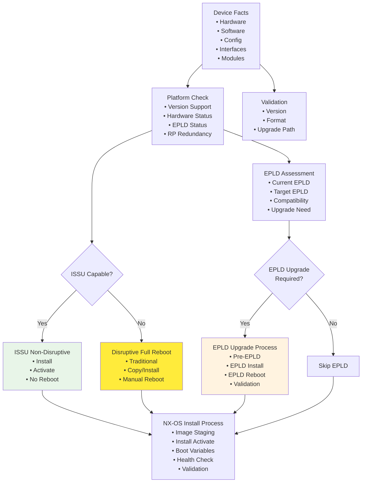
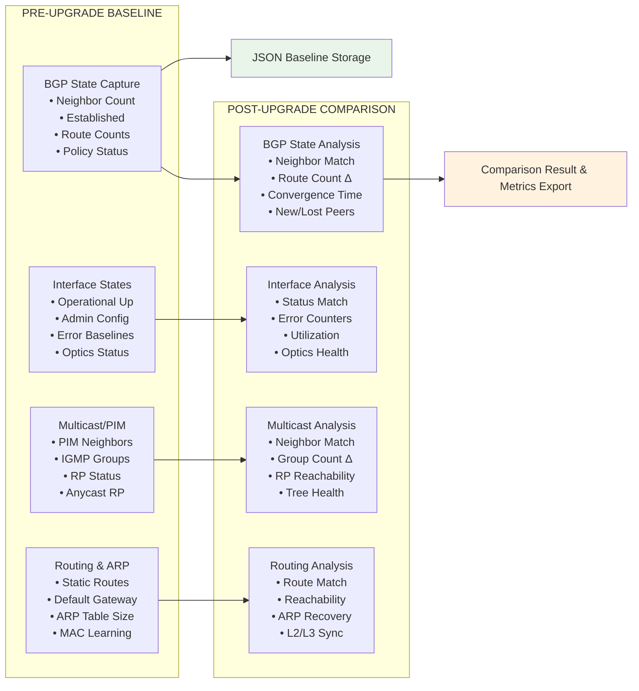
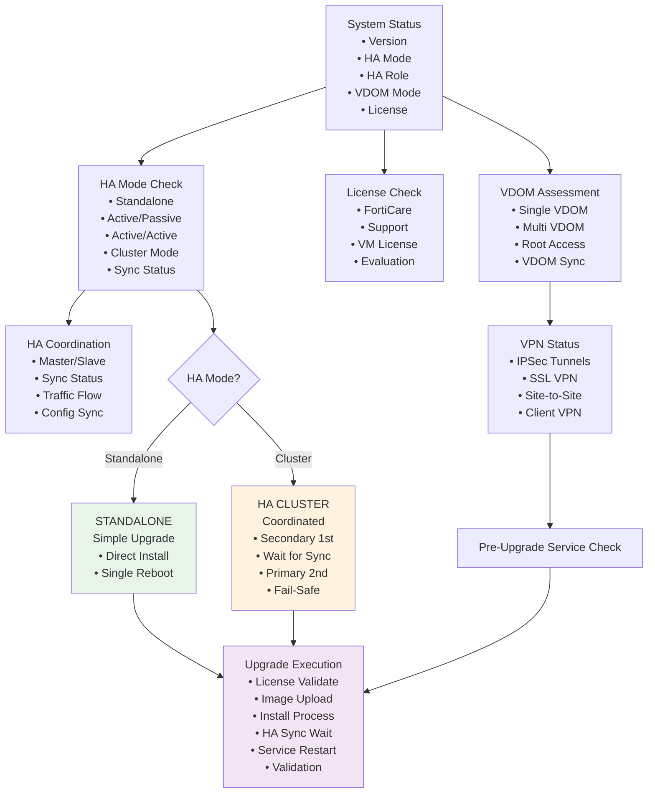
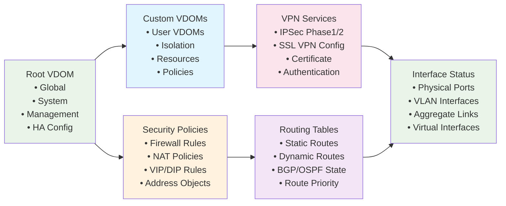
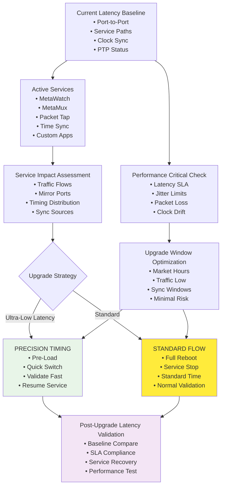
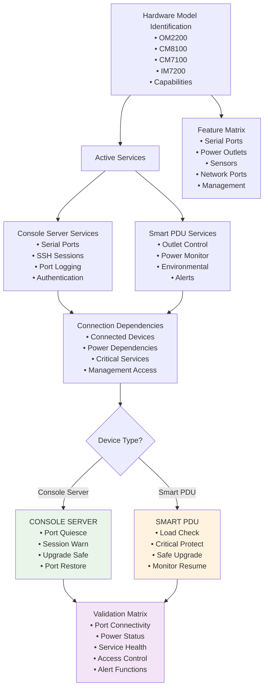

# Platform-Specific Implementation Guide

This document provides detailed implementation diagrams and specifications for each supported network platform.

## Platform Support Matrix

| Platform | Collection | Features | Validation | Status |
|----------|------------|----------|------------|--------|
| **Cisco NX-OS** | `cisco.nxos` | 95% ████████░░ | 85% ████████░░ | ✅ READY |
| **Cisco IOS-XE** | `cisco.ios` | 70% ███████░░░ | 50% █████░░░░░ | ⚠️ GAPS |
| **FortiOS** | `fortinet.fortios` | 90% █████████░ | 90% █████████░ | ✅ READY |
| **Metamako MOS** | `ansible.netcommon` | 85% ████████░░ | 85% ████████░░ | ✅ READY |
| **Opengear** | `ansible.netcommon` | 80% ████████░░ | 80% ████████░░ | ✅ READY |

**Legend**: █ Complete  ░ Missing/Incomplete

## Cisco NX-OS Implementation Details

### NX-OS Upgrade Flow Architecture



### NX-OS Validation Framework



## Cisco IOS-XE Implementation Details

### IOS-XE Mode Detection & Upgrade Flow

```mermaid
graph TD
    A[Platform Info<br/>• Hardware<br/>• IOS Version<br/>• Boot Config<br/>• Filesystem<br/>• Available Space] --> B[Install Support Detection<br/>• show install<br/>• packages.conf<br/>• Platform Capability<br/>• Space Check]
    
    A --> C[Storage Management<br/>• Bootflash<br/>• Space Calculation<br/>• Cleanup Old Images<br/>• Image Verification]
    
    C --> D[Pre-Validation<br/>• Connectivity<br/>• Permissions<br/>• Resources<br/>• Dependencies]
    
    B --> E{Mode Decision}
    
    E -->|Install Mode<br/>✓ Supported<br/>✓ Sufficient Space<br/>✓ Modern IOS| F[INSTALL MODE<br/>(Preferred)<br/>• Add Package<br/>• Activate<br/>• Commit<br/>• No Reboot*]
    
    E -->|Bundle Mode<br/>✓ Legacy Support<br/>✓ Fallback<br/>✓ Compatible| G[BUNDLE MODE<br/>(Legacy)<br/>• Copy Image<br/>• Boot System<br/>• Save Config<br/>• Reboot Required]
    
    F --> H[Execution Engine<br/>• Method-Specific<br/>• Error Handling<br/>• Progress Monitor<br/>• State Validation]
    G --> H
    
    style F fill:#e8f5e8
    style G fill:#ffeb3b
    style H fill:#f3e5f5
```

### IOS-XE Validation Gaps (Critical)

| **Validation Component** | **PROJECT_REQUIREMENTS.md** | **Current Status** | **Priority** |
|-------------------------|----------------------------|-------------------|-------------|
| **Interface & Optics States** | ✅ Required<br/>• `show ip interface brief`<br/>• `show interfaces status`<br/>• `show interfaces transceiver` | ✅ Basic interfaces implemented<br/>❌ **Optics validation MISSING**<br/>📁 Need: `optics-validation.yml` | 🟡 MED |
| **BGP Routing Tables** | ✅ Required<br/>• `show ip bgp summary`<br/>• `show ip route bgp` | ✅ Basic BGP implemented<br/>🟡 Could enhance with more detail | ✅ DONE |
| **ARP Validation** | ✅ Required<br/>• `show arp` | ✅ Implemented | ✅ DONE |
| **IPSec Tunnel Validation** | ✅ Required<br/>• `show crypto session`<br/>• `show crypto ipsec sa`<br/>• `show crypto isakmp sa` | ❌ **COMPLETELY MISSING**<br/>📁 Need: `ipsec-validation.yml`<br/>🚨 **CRITICAL for enterprise** | 🔥 HIGH |
| **BFD Session Validation** | ✅ Required<br/>• `show bfd summary`<br/>• `show bfd neighbors`<br/>• `show bfd session` | ❌ **COMPLETELY MISSING**<br/>📁 Need: `bfd-validation.yml`<br/>🚨 **CRITICAL for fast failover** | 🔥 HIGH |

**Implementation Priority:**
- 🔥 **HIGH**: IPSec validation - Enterprise VPN requirement
- 🔥 **HIGH**: BFD validation - Network convergence requirement
- 🟡 **MED**: Optics validation - Hardware health requirement

## FortiOS Implementation Details

### FortiOS HA-Aware Upgrade Flow



### FortiOS Validation Matrix



## Metamako MOS Implementation Details

### Ultra-Low Latency Considerations



## Opengear Implementation Details

### Multi-Model Device Management



## Implementation Completion Roadmap

### Critical Path to Production

```mermaid
graph LR
    subgraph "WEEK 1-2"
        A[IOS-XE GAPS<br/>(Critical)]
        B[🔥 HIGH PRIORITY<br/>• IPSec Valid<br/>• BFD Valid<br/>• Optics Valid<br/>• Integration]
        C[TASKS REQUIRED<br/>• 3 Files Create<br/>• Main.yml Update<br/>• Integration<br/>• Test & Verify]
    end
    
    subgraph "WEEK 3-4"
        D[ENHANCEMENT<br/>(Optional)]
        E[🟡 MED PRIORITY<br/>• IGMP for NXOS<br/>• Enhanced BFD<br/>• More Metrics<br/>• Docs Complete]
        F[NICE TO HAVE<br/>• Enhanced Dash<br/>• More Validation<br/>• Advanced Alert<br/>• Extra Metrics]
    end
    
    subgraph "PRODUCTION READY"
        G[FULL DEPLOYMENT]
        H[✅ COMPLETE<br/>• All Platforms<br/>• Full Features<br/>• Comprehensive<br/>• Production]
        I[ENTERPRISE READY<br/>• 5/5 Platforms<br/>• Full Validate<br/>• Monitoring]
    end
    
    A --> B --> C
    C --> D --> E --> F
    F --> G --> H --> I
    
    style A fill:#ffcdd2
    style B fill:#ffcdd2
    style D fill:#fff3e0
    style E fill:#fff3e0
    style G fill:#e8f5e8
    style H fill:#e8f5e8
    style I fill:#e8f5e8
```

This platform implementation guide provides the technical foundation for understanding each vendor's specific requirements, current implementation status, and completion roadmap.