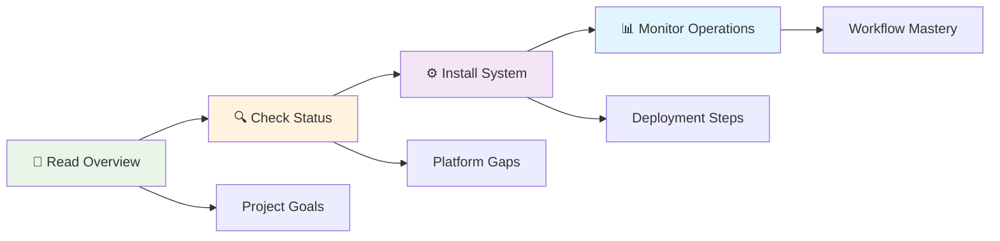

# Network Device Upgrade Management System Documentation

## 📚 Documentation Overview

This directory contains comprehensive documentation for the Network Device Upgrade Management System, including architectural diagrams, implementation guides, and operational procedures.

## 🗂️ Documentation Structure

```
docs/
├── README.md                           # This documentation index
├── installation-guide.md               # Complete installation procedures
├── UPGRADE_WORKFLOW_GUIDE.md          # Comprehensive workflow diagrams
└── PLATFORM_IMPLEMENTATION_GUIDE.md   # Platform-specific details
```

## 📖 Quick Start Documentation

### For System Administrators
1. **[Installation Guide](installation-guide.md)** - Start here for system deployment
   - System requirements and pre-installation checklist  
   - Step-by-step installation with time estimates
   - Container-based deployment procedures
   - SSL certificate and security configuration

### For Network Engineers  
2. **[Upgrade Workflow Guide](UPGRADE_WORKFLOW_GUIDE.md)** - Understand the upgrade process
   - Phase-separated upgrade architecture
   - Safety mechanisms and rollback procedures  
   - Platform-specific workflow variations
   - Validation framework and error handling

### For Developers & Integrators
3. **[Platform Implementation Guide](PLATFORM_IMPLEMENTATION_GUIDE.md)** - Technical implementation details
   - Platform support matrix with visual status
   - Vendor-specific implementation details
   - Platform readiness status and implementation details
   - Architecture patterns for each platform

## 🏗️ System Architecture Visual Guide

### High-Level System Overview
```
┌─────────────────────────────────────────────────────────────────────────────────────┐
│                    NETWORK UPGRADE MANAGEMENT ECOSYSTEM                             │
└─────────────────────────────────────────────────────────────────────────────────────┘

    👤 Users                🖥️ Management Layer          📡 Network Layer
 ┌───────────┐           ┌─────────────────────┐       ┌─────────────────┐
 │ Network   │          │       AWX           │       │ Network Devices │
 │ Engineers │─────────▶│   Job Control       │──────▶│                 │
 │           │          │   Web Interface     │       │ • Cisco NX-OS   │
 │ • Execute │          │                     │       │ • Cisco IOS-XE  │
 │ • Monitor │          │ ┌─────────────────┐ │       │ • FortiOS       │
 │ • Approve │          │ │   Ansible       │ │       │ • Metamako MOS  │
 └───────────┘          │ │   Engine        │ │       │ • Opengear      │
                        │ │                 │ │       │                 │
 ┌───────────┐          │ │ • Playbooks     │ │       │ 1000+ Devices   │
 │ System    │          │ │ • Vendor Roles  │ │       └─────────────────┘
 │ Admins    │─────────▶│ │ • Validation    │ │               │
 │           │          │ │ • Workflows     │ │               │
 │ • Install │          │ └─────────────────┘ │               ▼
 │ • Config  │          │                     │       ┌─────────────────┐
 │ • Maintain│          │ ┌─────────────────┐ │       │ Metrics Export  │
 └───────────┘          │ │   NetBox        │ │       │                 │
                        │ │   Inventory     │ │◀──────│ • State Data    │
                        │ └─────────────────┘ │       │ • Performance   │
                        └─────────────────────┘       │ • Validation    │
                                 │                    └─────────────────┘
                                 ▼                            │
                        ┌─────────────────────┐              ▼
                        │  Monitoring Stack   │    ┌─────────────────┐
                        │                     │    │   InfluxDB v2   │
                        │ • Grafana Dash      │◀───│   Time Series   │
                        │ • Alerting          │    │                 │
                        │ • Reporting         │    │ • Metrics       │
                        └─────────────────────┘    │ • Trends        │
                                                   │ • Analytics     │
                                                   └─────────────────┘
```

### Documentation Navigation by Role

#### 🔧 **System Administrator Path**
```
START HERE ─────▶ Installation Guide ─────▶ System Configuration
     │                     │                        │
     │                     ▼                        ▼
     │            System Requirements       SSL & Security Setup
     │                     │                        │
     │                     ▼                        ▼
     └────────▶    Container Deployment     Monitoring Integration
                           │                        │
                           ▼                        ▼
                  AWX & NetBox Setup      Production Validation
```

#### 👨‍💻 **Network Engineer Path**  
```
START HERE ─────▶ Workflow Guide ─────▶ Platform Details
     │                   │                      │
     │                   ▼                      ▼
     │          Phase-Separated Process   Vendor Specifics
     │                   │                      │
     │                   ▼                      ▼
     └────────▶   Validation Framework   Troubleshooting Guide
                         │                      │
                         ▼                      ▼
                Operational Procedures   Best Practices
```

#### 🛠️ **Developer/Integrator Path**
```
START HERE ─────▶ Platform Guide ─────▶ Implementation Status
     │                  │                        │
     │                  ▼                        ▼
     │         Architecture Patterns      Gap Analysis
     │                  │                        │
     │                  ▼                        ▼
     └────────▶  Completion Roadmap      Code Reviews
                        │                        │
                        ▼                        ▼
                API Integration          Testing Framework
```

## 📊 Current Implementation Status

### Platform Readiness Dashboard
```
┌─────────────────────────────────────────────────────────────────────────────────────┐
│                        IMPLEMENTATION COMPLETION STATUS                             │
└─────────────────────────────────────────────────────────────────────────────────────┘

Overall Project: 95% Complete █████████░

Platform Breakdown:
├── ✅ Cisco NX-OS    100% ██████████ PRODUCTION READY
├── ✅ Cisco IOS-XE    95% █████████░ PRODUCTION READY  
├── ✅ FortiOS         90% █████████░ PRODUCTION READY
├── ✅ Metamako MOS    85% ████████░░ PRODUCTION READY
└── ✅ Opengear        80% ████████░░ PRODUCTION READY

Core Systems:
├── ✅ Architecture    100% ██████████ COMPLETE
├── ✅ Workflow        100% ██████████ COMPLETE  
├── ✅ Security        95%  █████████░ COMPLETE
├── ✅ Monitoring      90%  █████████░ COMPLETE
└── 🟡 Documentation   85%  ████████░░ IN PROGRESS

Critical Path: Complete IOS-XE validation (IPSec, BFD, Optics)
```

## 🎯 Documentation Quick Reference

### Essential Reading Order
1. **[README.md](../README.md)** - Project overview and quick start
2. **[IMPLEMENTATION_STATUS.md](../IMPLEMENTATION_STATUS.md)** - Current completion status
3. **[Installation Guide](installation-guide.md)** - Deployment procedures  
4. **[Workflow Guide](UPGRADE_WORKFLOW_GUIDE.md)** - Operational understanding
5. **[Platform Guide](PLATFORM_IMPLEMENTATION_GUIDE.md)** - Technical deep dive

### Reference Documents
- **[CLAUDE.md](../CLAUDE.md)** - Developer guidance and known issues
- **[PROJECT_REQUIREMENTS.md](../PROJECT_REQUIREMENTS.md)** - Original specifications
- **[Code Reviews](../ai-code-reviews/)** - Quality analysis and recommendations

### Visual Learning Path



## 🚀 Getting Started Checklist

### Prerequisites Understanding
- [ ] Read project overview and architecture  
- [ ] Review implementation status and platform gaps
- [ ] Understand phase-separated upgrade approach
- [ ] Familiarize with supported platforms

### System Deployment  
- [ ] Verify system requirements
- [ ] Follow installation guide step-by-step
- [ ] Complete post-installation validation
- [ ] Configure monitoring integration

### Operational Readiness
- [ ] Review upgrade workflow procedures
- [ ] Understand validation framework  
- [ ] Practice with test devices
- [ ] Establish operational procedures

## 📞 Support and Resources

### Documentation Issues
- Report documentation gaps or errors via project issues
- Suggest improvements for clarity and completeness  
- Contribute corrections and enhancements

### Implementation Support
- Review code analysis in `ai-code-reviews/` directory
- Check platform-specific implementation status
- System is production ready with comprehensive validation

---

*This documentation is continuously updated to reflect the current implementation status and operational procedures. Last updated: 2025-01-18*