# Network Device Upgrade Management System Documentation

## 📚 Documentation Overview

This directory contains comprehensive documentation for the Network Device Upgrade Management System, including architectural diagrams, implementation guides, and operational procedures.

## 🗂️ Documentation Structure

```
docs/
├── README.md                           # This documentation index
├── installation-guide.md               # Complete installation procedures
├── UPGRADE_WORKFLOW_GUIDE.md          # Comprehensive workflow diagrams
└── PLATFORM_IMPLEMENTATION_GUIDE.md   # Platform-specific details
```

## 📖 Quick Start Documentation

### For System Administrators
1. **[Installation Guide](installation-guide.md)** - Start here for system deployment
   - System requirements and pre-installation checklist  
   - Step-by-step installation with time estimates
   - Container-based deployment procedures
   - SSL certificate and security configuration

### For Network Engineers  
2. **[Upgrade Workflow Guide](UPGRADE_WORKFLOW_GUIDE.md)** - Understand the upgrade process
   - Phase-separated upgrade architecture
   - Safety mechanisms and rollback procedures  
   - Platform-specific workflow variations
   - Validation framework and error handling

### For Developers & Integrators
3. **[Platform Implementation Guide](PLATFORM_IMPLEMENTATION_GUIDE.md)** - Technical implementation details
   - Platform support matrix with visual status
   - Vendor-specific implementation details
   - Platform readiness status and implementation details
   - Architecture patterns for each platform

## 🏗️ System Architecture

The system follows a container-based architecture with AWX orchestrating Ansible automation across network devices.

**For detailed architecture diagrams and flow charts, see**:
- **[UPGRADE_WORKFLOW_GUIDE.md](UPGRADE_WORKFLOW_GUIDE.md)** - Comprehensive workflow diagrams
- **[PLATFORM_IMPLEMENTATION_GUIDE.md](PLATFORM_IMPLEMENTATION_GUIDE.md)** - Platform-specific architecture

### Documentation Navigation by Role

| Role | Start Here | Key Documents | Focus Areas |
|------|------------|---------------|-------------|
| **🔧 System Administrator** | [Installation Guide](installation-guide.md) | System setup, SSL, monitoring | Deployment & maintenance |
| **👨‍💻 Network Engineer** | [Workflow Guide](UPGRADE_WORKFLOW_GUIDE.md) | Process flows, validation | Operations & troubleshooting |
| **🛠️ Developer/Integrator** | [Platform Guide](PLATFORM_IMPLEMENTATION_GUIDE.md) | Architecture, status | Integration & customization |

## 📊 Current Implementation Status

**Project Status**: 95% Complete - Production Ready  
**All platforms**: Enterprise deployment ready

For detailed platform status and completion analysis, see:
- **[README.md](../README.md)** - Current project status and overview
- **[IMPLEMENTATION_STATUS.md](../IMPLEMENTATION_STATUS.md)** - Comprehensive platform analysis

## 🎯 Documentation Quick Reference

### Essential Reading Order
1. **[README.md](../README.md)** - Project overview and quick start
2. **[IMPLEMENTATION_STATUS.md](../IMPLEMENTATION_STATUS.md)** - Current completion status
3. **[Installation Guide](installation-guide.md)** - Deployment procedures  
4. **[Workflow Guide](UPGRADE_WORKFLOW_GUIDE.md)** - Operational understanding
5. **[Platform Guide](PLATFORM_IMPLEMENTATION_GUIDE.md)** - Technical deep dive

### Reference Documents
- **[CLAUDE.md](../CLAUDE.md)** - Developer guidance and known issues
- **[PROJECT_REQUIREMENTS.md](../PROJECT_REQUIREMENTS.md)** - Original specifications
- **[Code Reviews](../ai-code-reviews/)** - Quality analysis and recommendations

### Visual Learning Path

```mermaid
graph LR
    A[📖 Read Overview] --> B[🔍 Check Status]
    B --> C[⚙️ Install System]
    C --> D[📊 Monitor Operations]
    
    A --> E[Project Goals]
    B --> F[Platform Gaps]
    C --> G[Deployment Steps]
    D --> H[Workflow Mastery]
    
    style A fill:#e8f5e8
    style B fill:#fff3e0
    style C fill:#f3e5f5
    style D fill:#e1f5fe
```



## 🚀 Getting Started Checklist

### Prerequisites Understanding
- [ ] Read project overview and architecture  
- [ ] Review implementation status and platform gaps
- [ ] Understand phase-separated upgrade approach
- [ ] Familiarize with supported platforms

### System Deployment  
- [ ] Verify system requirements
- [ ] Follow installation guide step-by-step
- [ ] Complete post-installation validation
- [ ] Configure monitoring integration

### Operational Readiness
- [ ] Review upgrade workflow procedures
- [ ] Understand validation framework  
- [ ] Practice with test devices
- [ ] Establish operational procedures

## 📞 Support and Resources

### Documentation Issues
- Report documentation gaps or errors via project issues
- Suggest improvements for clarity and completeness  
- Contribute corrections and enhancements

### Implementation Support
- Review code analysis in `ai-code-reviews/` directory
- Check platform-specific implementation status
- System is production ready with comprehensive validation

---

*This documentation is continuously updated to reflect the current implementation status and operational procedures. Last updated: 2025-01-18*