# Network Device Upgrade Management System Documentation

## 📚 Documentation Overview

This directory contains comprehensive documentation for the Network Device Upgrade Management System, including architectural diagrams, implementation guides, and operational procedures.

## 🗂️ Documentation Structure

```
docs/
├── README.md                               # This documentation index
├── DOCUMENTATION_ANALYSIS_REPORT.md       # Documentation analysis and consolidation report
├── IMPLEMENTATION_STATUS.md                # Current platform implementation status
├── PROJECT_REQUIREMENTS.md                # Complete system requirements
├── TESTING_AND_QA_COMPREHENSIVE_GUIDE.md  # Consolidated testing & QA guide
├── installation-guide.md                  # Complete installation procedures
├── container-deployment.md                # Container deployment guide
├── UPGRADE_WORKFLOW_GUIDE.md               # Comprehensive workflow diagrams
├── PLATFORM_IMPLEMENTATION_GUIDE.md       # Platform-specific details
├── WORKFLOW_ARCHITECTURE.md               # GitHub Actions workflow architecture
├── WORKFLOW_INTEGRATION_SUMMARY.md        # Workflow integration details
└── ../tests/TEST_FRAMEWORK_GUIDE.md       # Testing implementation guide
```

## 📖 Quick Start Documentation

### For System Administrators
1. **[Installation Guide](installation-guide.md)** - Start here for system deployment
   - System requirements and pre-installation checklist  
   - Step-by-step installation with time estimates
   - Native systemd service deployment procedures
   - SSL certificate and security configuration
   - **NEW**: Development and testing setup without devices

### For Developers and Testing
2. **[Testing & QA Comprehensive Guide](TESTING_AND_QA_COMPREHENSIVE_GUIDE.md)** - Complete testing ecosystem overview
   - Test coverage analysis and critical gap identification
   - Business impact assessment and ROI analysis
   - Implementation roadmap and priority matrix
   - Sample test case implementations for critical gaps
   - Quality assurance framework and success metrics

3. **[Testing Implementation Guide](../tests/TEST_FRAMEWORK_GUIDE.md)** - Technical testing procedures
   - Mock inventory testing for all 5 platforms
   - Unit testing, integration testing, performance testing
   - Template rendering and workflow logic validation
   - CI/CD integration with GitHub Actions
   - Mac/Linux development environment setup

### For Network Engineers
4. **[Upgrade Workflow Guide](UPGRADE_WORKFLOW_GUIDE.md)** - Understand the upgrade process
   - Phase-separated upgrade architecture
   - Safety mechanisms and rollback procedures
   - Platform-specific workflow variations
   - Validation framework and error handling

### For Developers & Integrators
5. **[Platform Implementation Guide](PLATFORM_IMPLEMENTATION_GUIDE.md)** - Technical implementation details
   - Platform support matrix with visual status
   - Vendor-specific implementation details
   - Platform readiness status and implementation details
   - Architecture patterns for each platform

6. **[Workflow Architecture Guide](WORKFLOW_ARCHITECTURE.md)** - CI/CD and automation architecture
   - GitHub Actions workflow structure and optimization
   - Container build pipeline and deployment
   - Technology stack and testing framework
   - Performance optimizations and best practices

## 🏗️ System Architecture

The system follows a native service architecture with AWX orchestrating Ansible automation across network devices via systemd services.

**For detailed architecture diagrams and flow charts, see**:
- **[UPGRADE_WORKFLOW_GUIDE.md](UPGRADE_WORKFLOW_GUIDE.md)** - Comprehensive workflow diagrams
- **[PLATFORM_IMPLEMENTATION_GUIDE.md](PLATFORM_IMPLEMENTATION_GUIDE.md)** - Platform-specific architecture

### Documentation Navigation by Role

| Role | Start Here | Key Documents | Focus Areas |
|------|------------|---------------|-------------|
| **🔧 System Administrator** | [Installation Guide](installation-guide.md) | System setup, SSL, monitoring | Deployment & maintenance |
| **👨‍💻 Network Engineer** | [Workflow Guide](UPGRADE_WORKFLOW_GUIDE.md) | Process flows, validation | Operations & troubleshooting |
| **🛠️ Developer/Integrator** | [Platform Guide](PLATFORM_IMPLEMENTATION_GUIDE.md) | Architecture, status | Integration & customization |
| **🧪 QA/Testing** | [Testing & QA Guide](TESTING_AND_QA_COMPREHENSIVE_GUIDE.md) | Test coverage, gap analysis | Quality assurance |

## 📊 Current Implementation Status

**Project Status**: 100% Complete - Production Ready  
**All platforms**: Enterprise deployment ready

For detailed platform status and completion analysis, see:
- **[README.md](../README.md)** - Current project status and overview
- **[IMPLEMENTATION_STATUS.md](IMPLEMENTATION_STATUS.md)** - Comprehensive platform analysis

## 🎯 Documentation Quick Reference

### Essential Reading Order
1. **[README.md](../README.md)** - Project overview and quick start
2. **[IMPLEMENTATION_STATUS.md](IMPLEMENTATION_STATUS.md)** - Current completion status
3. **[Installation Guide](installation-guide.md)** - Deployment procedures
4. **[Testing & QA Guide](TESTING_AND_QA_COMPREHENSIVE_GUIDE.md)** - Quality assurance overview
5. **[Workflow Guide](UPGRADE_WORKFLOW_GUIDE.md)** - Operational understanding
6. **[Platform Guide](PLATFORM_IMPLEMENTATION_GUIDE.md)** - Technical deep dive

### Reference Documents
- **[CLAUDE.md](../CLAUDE.md)** - Developer guidance and testing procedures
- **[PROJECT_REQUIREMENTS.md](PROJECT_REQUIREMENTS.md)** - System specifications

### Visual Learning Path

```mermaid
graph LR
    A[📖 Read Overview] --> B[🔍 Check Status]
    B --> C[⚙️ Install System]
    C --> D[📊 Monitor Operations]
    
    A --> E[Project Goals]
    B --> F[Platform Gaps]
    C --> G[Deployment Steps]
    D --> H[Workflow Mastery]
    
    style A fill:#e8f5e8
    style B fill:#fff3e0
    style C fill:#f3e5f5
    style D fill:#e1f5fe
```



## 🚀 Getting Started Checklist

### Prerequisites Understanding
- [ ] Read project overview and architecture  
- [ ] Review implementation status and platform gaps
- [ ] Understand phase-separated upgrade approach
- [ ] Familiarize with supported platforms

### System Deployment  
- [ ] Verify system requirements
- [ ] Follow installation guide step-by-step
- [ ] Complete post-installation validation
- [ ] Configure monitoring integration

### Operational Readiness
- [ ] Review upgrade workflow procedures
- [ ] Understand validation framework  
- [ ] Practice with test devices
- [ ] Establish operational procedures

## 📞 Support and Resources

### Documentation Issues
- Report documentation gaps or errors via project issues
- Suggest improvements for clarity and completeness  
- Contribute corrections and enhancements

### Implementation Support
- Check platform-specific implementation status
- System is production ready with comprehensive validation

---

*This documentation is continuously updated to reflect the current implementation status and operational procedures. Last updated: September 13, 2025*