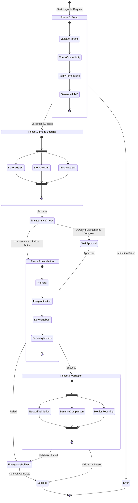
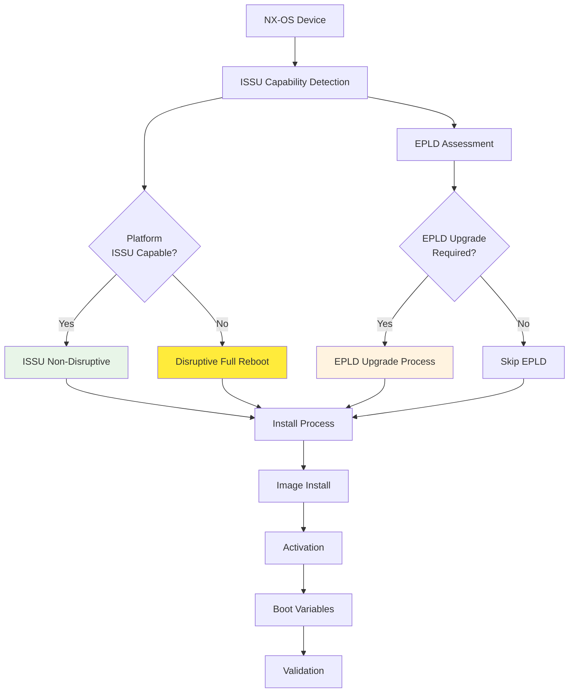
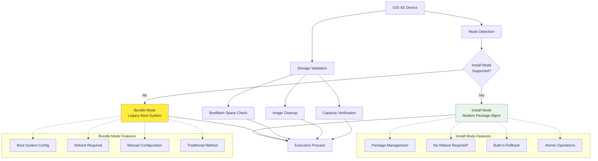
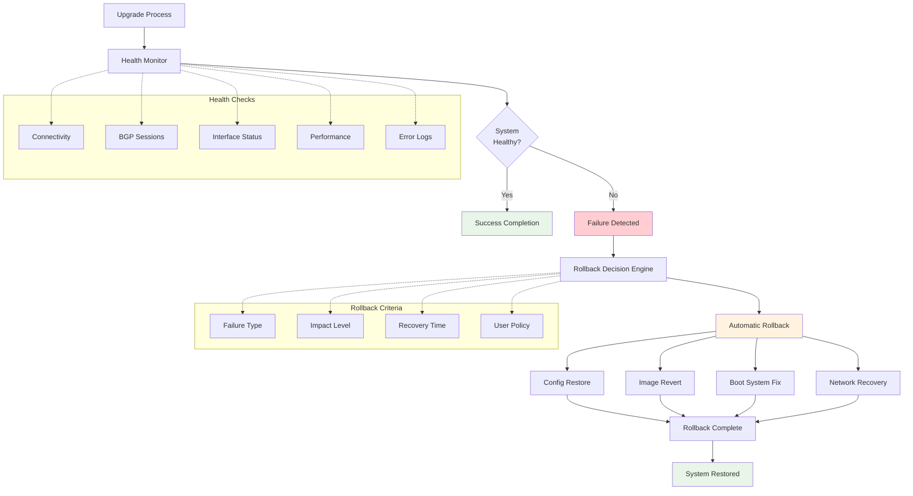

# Network Device Upgrade Workflow Guide

This document provides comprehensive workflow diagrams and detailed explanations of the upgrade process architecture.

## Phase-Separated Upgrade Overview

The system implements a **three-phase upgrade approach** designed for operational safety and business continuity:

```mermaid
graph LR
    subgraph "Phase 1: Image Loading 🕐"
        A1[Health Check]
        A2[Storage Cleanup]
        A3[Image Transfer]
        A4[Hash Verification]
        A1 --> A2 --> A3 --> A4
    end
    
    subgraph "Phase 2: Installation 🔒"
        B1[Pre-Install Check]
        B2[Image Activation]
        B3[Device Reboot]
        B4[Recovery Monitor]
        B1 --> B2 --> B3 --> B4
    end
    
    subgraph "Phase 3: Validation ✅"
        C1[Network State]
        C2[Protocol Check]
        C3[Baseline Compare]
        C4[Auto Rollback]
        C5[Metrics Export]
        C1 --> C2 --> C3 --> C4
        C3 --> C5
    end
    
    A4 --> B1
    B4 --> C1
    
    style A1 fill:#e8f5e8
    style B1 fill:#fff3e0
    style C1 fill:#f3e5f5
```



**Phase Summary:**
- **Phase 1** 🕐: Business Hours Safe (No Downtime, Parallelizable)
- **Phase 2** 🔒: Maintenance Window (Planned Downtime, Sequential)
- **Phase 3** ✅: Validation & Recovery (Validation Time, Observable)

## Detailed Workflow State Machine



**Key Decision Points:**
1. **Phase 0 → Phase 1**: Parameter validation and connectivity checks
2. **Phase 1 → Phase 2**: Maintenance window approval required
3. **Phase 2 → Phase 3**: Installation success verification
4. **Any Phase → Rollback**: Failure triggers or manual intervention

## Platform-Specific Workflow Variations

### Cisco NX-OS ISSU Flow



**ISSU Decision Matrix:**
- ✅ **ISSU Capable**: Non-disruptive, faster recovery
- ⚠️ **EPLD Required**: Additional reboot cycle needed
- 🔄 **Disruptive**: Traditional upgrade with full reboot

### Cisco IOS-XE Mode Detection



**Mode Selection Criteria:**
- 🚀 **Install Mode**: Preferred for modern platforms, faster, safer
- 🔄 **Bundle Mode**: Fallback for legacy platforms or unsupported install mode
- 📊 **Storage Check**: Ensures sufficient space for selected method

## Error Handling and Rollback Flows

### Automatic Rollback Triggers



## Validation Framework Architecture

### Multi-Layer Validation Strategy
```
┌─────────────────────────────────────────────────────────────────────────────────────┐
│                        COMPREHENSIVE VALIDATION FRAMEWORK                          │
└─────────────────────────────────────────────────────────────────────────────────────┘

     PRE-UPGRADE           DURING UPGRADE           POST-UPGRADE
    ┌─────────────┐        ┌─────────────┐         ┌─────────────┐
    │ BASELINE    │───────▶│ MONITORING  │────────▶│ COMPARISON  │
    │ CAPTURE     │        │ & CHECKS    │         │ & ANALYSIS  │
    └─────────────┘        └─────────────┘         └─────────────┘
           │                       │                       │
           ▼                       ▼                       ▼
┌─────────────────────┐  ┌─────────────────────┐  ┌─────────────────────┐
│ • BGP Neighbors     │  │ • Connectivity      │  │ • State Diff        │
│ • Interface States  │  │ • Process Monitor   │  │ • Route Count       │
│ • Routing Tables    │  │ • Error Detection   │  │ • Neighbor Status   │
│ • ARP Tables        │  │ • Performance       │  │ • Protocol Health   │
│ • Protocol Status   │  │ • Log Analysis      │  │ • Convergence Time  │
│ • Multicast Trees   │  │ • System Health     │  │ • Performance       │
│ • BFD Sessions      │  │ • Resource Usage    │  │ • Error Analysis    │
│ • IPSec Tunnels     │  │ • Service Status    │  │ • Compliance Check  │
│ • Optics Status     │  │ • Network Flow      │  │ • Rollback Decision │
└─────────────────────┘  └─────────────────────┘  └─────────────────────┘
           │                       │                       │
           ▼                       ▼                       ▼
     ┌─────────────┐        ┌─────────────┐         ┌─────────────┐
     │ JSON Storage│        │ Real-time   │         │ InfluxDB    │
     │ Local Files │        │ Streaming   │         │ Metrics     │
     └─────────────┘        └─────────────┘         └─────────────┘
```

## Metrics and Observability Flow

### Real-Time Monitoring Pipeline
```
Network Devices ─────┐
                     │
                     ▼
          ┌─────────────────────┐      ┌─────────────────────┐
          │ Ansible Validation  │─────▶│ Structured Data     │
          │ Tasks               │      │ Processing          │
          │                     │      │                     │
          │ • Command Execution │      │ • JSON Parsing      │
          │ • Output Capture    │      │ • Data Validation   │
          │ • State Analysis    │      │ • Metric Generation │
          │ • Error Detection   │      │ • Tagging Strategy  │
          └─────────────────────┘      └─────────────────────┘
                     │                            │
                     ▼                            ▼
          ┌─────────────────────┐      ┌─────────────────────┐
          │ Local Storage       │      │ InfluxDB Export     │
          │                     │      │                     │
          │ • Baseline Files    │      │ • Line Protocol     │
          │ • Comparison Data   │      │ • Time Series       │
          │ • Audit Logs        │      │ • Device Tags       │
          │ • Error Context     │      │ • Status Metrics    │
          └─────────────────────┘      └─────────────────────┘
                     │                            │
                     ▼                            ▼
          ┌─────────────────────┐      ┌─────────────────────┐
          │ AWX Job Logs        │      │ Grafana Dashboards │
          │                     │      │                     │
          │ • Execution History │      │ • Real-time Views   │
          │ • Debug Information │      │ • Alert Rules       │
          │ • Performance Data  │      │ • Trend Analysis    │
          │ • User Actions      │      │ • Executive Reports │
          └─────────────────────┘      └─────────────────────┘
```

## Operational Safety Features

### Built-in Safety Mechanisms
```
┌─────────────────────────────────────────────────────────────────────────────────────┐
│                            OPERATIONAL SAFETY FRAMEWORK                             │
└─────────────────────────────────────────────────────────────────────────────────────┘

    PREVENTION              DETECTION               RECOVERY
  ┌─────────────┐         ┌─────────────┐         ┌─────────────┐
  │ PRE-CHECKS  │────────▶│ MONITORING  │────────▶│ ROLLBACK    │
  └─────────────┘         └─────────────┘         └─────────────┘
        │                       │                       │
        ▼                       ▼                       ▼
┌───────────────┐       ┌───────────────┐       ┌───────────────┐
│ • Permissions │       │ • Connectivity│       │ • Auto Restore│
│ • Connectivity│       │ • Protocol    │       │ • Config Revert│
│ • Disk Space  │       │ • Performance │       │ • Image Revert│
│ • Image Hash  │       │ • Error Rate  │       │ • Boot Repair │
│ • Dependencies│       │ • Response    │       │ • Network Fix │
│ • Maintenance │       │ • Health      │       │ • Service Heal│
│ • Approval    │       │ • Compliance  │       │ • Alert Notify│
└───────────────┘       └───────────────┘       └───────────────┘
        │                       │                       │
        ▼                       ▼                       ▼
  ┌─────────────┐         ┌─────────────┐         ┌─────────────┐
  │ GATE KEEPER │         │ REAL-TIME   │         │ RECOVERY    │
  │ APPROVAL    │         │ TELEMETRY   │         │ VALIDATION  │
  └─────────────┘         └─────────────┘         └─────────────┘
```

This comprehensive workflow guide provides the visual foundation for understanding the system's operational approach, safety mechanisms, and platform-specific variations.