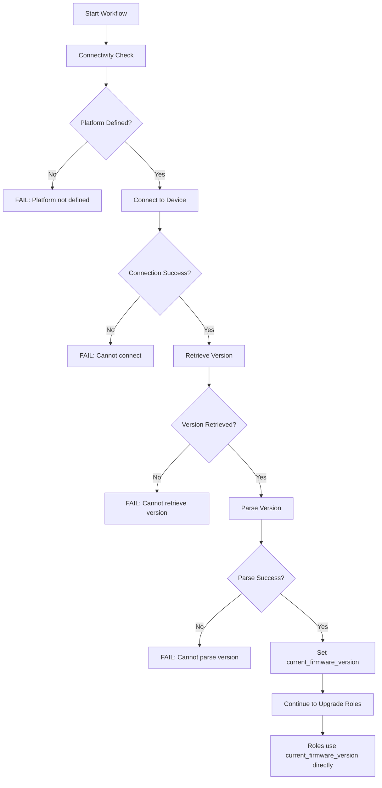

# Connectivity Check and Version Validation

## Overview

The connectivity check is the **single gate** for device connectivity and firmware version validation in the network device upgrade system. It validates reachability, authenticates to devices, retrieves current firmware version, and fails fast if any validation step fails.

**Location**: `ansible-content/roles/common/tasks/connectivity-check.yml`

**Purpose**: Establish baseline device connectivity and version information before any upgrade operations.

## Architecture

### Fail-Fast Design Pattern

The connectivity check implements a fail-fast design where:
1. **Single Validation Point**: ALL version retrieval and validation happens ONLY in connectivity-check
2. **No Fallbacks**: If version cannot be retrieved or parsed, the entire workflow stops immediately
3. **Fact Persistence**: Once validated, `current_firmware_version` is stored as a fact and reused throughout the workflow
4. **Assumption Downstream**: All upgrade roles assume `current_firmware_version` is already set and valid



## Platform Support

The connectivity check supports **5 network device platforms** with platform-specific version retrieval:

| Platform | Platform Value | Connection Type | Version Command | Version Regex |
|----------|---------------|-----------------|-----------------|---------------|
| **Cisco NX-OS** | `nxos` | `network_cli` | `show version` | `NXOS: version ([0-9.()A-Za-z]+)` |
| **Cisco IOS-XE** | `ios` | `network_cli` | `show version` | `Version ([0-9.()A-Za-z]+)` |
| **FortiOS** | `fortios` | `httpapi` | API: `system_status` | JSON: `.meta.results.version` |
| **Metamako MOS** | `metamako_mos` | `network_cli` | `show system info` | `Version:\s+([0-9.]+)` |
| **Opengear** | `opengear` | `ssh` | `config -g config.version` | Raw output (strip newlines) |

## Implementation Details

### 1. Platform Detection

The connectivity check wraps all tasks in a single block with platform validation:

```yaml
- name: Platform-based connectivity check
  when: platform is defined
  block:
    # All connectivity and version tasks here
```

If `platform` is not defined, the workflow fails with a clear error message listing required platform groups.

### 2. Version Retrieval (Per Platform)

Each platform has two tasks:
1. **Get Version**: Execute platform-specific command/API call
2. **Parse Version**: Extract version string and set facts

Example for Cisco NX-OS:

```yaml
- name: Get NX-OS version
  cisco.nxos.nxos_command:
    commands:
      - show version
  register: nxos_version_output
  changed_when: false
  vars:
    ansible_connection: ansible.netcommon.network_cli
    ansible_network_os: cisco.nxos.nxos
    ansible_user: "{{ vault_cisco_nxos_username }}"
    ansible_password: "{{ vault_cisco_nxos_password | default(omit) }}"
    ansible_ssh_private_key_file: "{{ vault_cisco_nxos_ssh_key | default(omit) }}"
  when: platform == 'nxos'

- name: Parse and store NX-OS version
  ansible.builtin.set_fact:
    device_version_info:
      raw_output: "{{ nxos_version_output.stdout[0] }}"
      platform: "{{ platform }}"
      timestamp: "{{ ansible_date_time.iso8601 }}"
      version: "{{ nxos_version_output.stdout[0] | regex_search('NXOS: version ([0-9.()A-Za-z]+)', '\\1') | first }}"
    current_firmware_version: "{{ nxos_version_output.stdout[0] | regex_search('NXOS: version ([0-9.()A-Za-z]+)', '\\1') | first }}"
  when:
    - platform == 'nxos'
    - nxos_version_output is defined
    - nxos_version_output.stdout is defined
    - nxos_version_output is succeeded
```

**Critical Detail**: No `| default('unknown')` fallback is used. If regex parsing fails, the task fails immediately.

### 3. Credential Mapping

Credentials are mapped at task execution time using task-level `vars:` block:

```yaml
vars:
  ansible_connection: ansible.netcommon.network_cli
  ansible_network_os: cisco.nxos.nxos
  ansible_user: "{{ vault_cisco_nxos_username }}"
  ansible_password: "{{ vault_cisco_nxos_password | default(omit) }}"
  ansible_ssh_private_key_file: "{{ vault_cisco_nxos_ssh_key | default(omit) }}"
```

**Note**: `| default(omit)` is allowed ONLY for optional module parameters (password OR key), NOT for version parsing.

### 4. Error Handling (Fail-Fast)

The entire version retrieval block is wrapped in a rescue handler that immediately fails:

```yaml
- name: Platform-based connectivity check
  block:
    # ... all version retrieval tasks ...

  rescue:
    - name: Connection or version retrieval failed
      ansible.builtin.fail:
        msg: |
          Failed to connect to device {{ inventory_hostname }} or retrieve version information.
          This is required for upgrade operations.

          Please check:
          - Device connectivity (network, SSH access)
          - Credentials (username, password, or SSH key)
          - Device is responding to commands

          Platform: {{ platform }}
          Error occurred during version retrieval.
```

**No Recovery**: If connectivity or version retrieval fails, the workflow stops completely.

### 5. Facts Set by Connectivity Check

The connectivity check sets the following facts:

- **`current_firmware_version`**: String containing parsed version (e.g., `9.3(10)`, `17.9.4a`, `7.2.5`)
- **`device_version_info`**: Dictionary with detailed version information:
  - `raw_output`: Complete command output
  - `platform`: Platform identifier
  - `timestamp`: ISO8601 timestamp of retrieval
  - `version`: Parsed version string (same as `current_firmware_version`)
- **`device_connectivity`**: Dictionary with connectivity status:
  - `device`: Device hostname
  - `platform`: Platform identifier
  - `timestamp`: ISO8601 timestamp
  - `basic_connectivity`: Boolean
  - `ping_successful`: Boolean
  - `cli_connectivity`: Boolean
  - `overall_status`: Boolean (AND of all checks)

## Usage in Upgrade Roles

### Cisco NX-OS Upgrade Role

**Location**: `ansible-content/roles/cisco-nxos-upgrade/tasks/main.yml`

```yaml
- name: Set current firmware version from connectivity check
  ansible.builtin.set_fact:
    nxos_upgrade_state: >
      "{{ nxos_upgrade_state | combine({'current_version': current_firmware_version}) }}"
```

**No Fallback**: Directly uses `current_firmware_version` without conditionals or fallback fact gathering.

### Cisco IOS-XE Upgrade Role

**Location**: `ansible-content/roles/cisco-iosxe-upgrade/tasks/main.yml`

```yaml
- name: Set current firmware version from connectivity check
  ansible.builtin.set_fact:
    iosxe_upgrade_state: >
      "{{ iosxe_upgrade_state | combine({'current_version': current_firmware_version}) }}"
```

### FortiOS Upgrade Role

**Location**: `ansible-content/roles/fortios-upgrade/tasks/main.yml`

```yaml
- name: Gather FortiOS device facts for HA/VDOM info
  fortinet.fortios.fortios_monitor_fact:
    vdom: "root"
    selector: "system_status"
  register: fortios_facts

- name: Parse device information
  ansible.builtin.set_fact:
    fortios_upgrade_state: "{{ fortios_upgrade_state | combine({
      'current_version': current_firmware_version,
      'ha_mode': fortios_facts.meta.results.ha_mode,
      'ha_role': fortios_facts.meta.results.ha_group_name,
      'vdom_mode': (fortios_facts.meta.results.vdom_mode == 'enable')
    }) }}"
```

**Note**: FortiOS still gathers facts but ONLY for HA/VDOM information, NOT for version. Version comes from `current_firmware_version`.

## Requirements

### Python Dependencies

The connectivity check requires the following Python packages:

**Required (Core)**:
- `ansible` >= 12.0.0
- `ansible-core` >= 2.19.2
- `paramiko` - SSH library (fallback)

**Recommended (Performance)**:
- `ansible-pylibssh` - Native libssh Python bindings for better SSH performance

**Why ansible-pylibssh?**
- **Performance**: 2-3x faster SSH connections compared to Paramiko
- **Compatibility**: Better support for modern SSH key formats (ed25519, ecdsa)
- **Native Library**: Uses libssh C library for efficiency
- **Ansible Integration**: Official Ansible SSH connection plugin

**Installation Warning**: If `ansible-pylibssh` is not installed, Ansible will show:
```
ansible-pylibssh not installed, falling back to paramiko
```

This is non-fatal but impacts performance on large deployments.

### System Dependencies

**For Non-Container (Direct Host Execution)**:

Install system packages based on your OS:

**Ubuntu/Debian**:
```bash
sudo apt-get update
sudo apt-get install -y \
  python3 \
  python3-pip \
  openssh-client \
  sshpass \
  libssh-dev     # Required for ansible-pylibssh compilation
```

**RHEL/CentOS/Fedora**:
```bash
sudo yum install -y \
  python3 \
  python3-pip \
  openssh-clients \
  sshpass \
  libssh-devel   # Required for ansible-pylibssh compilation
```

**macOS** (using Homebrew):
```bash
brew install \
  python@3.13 \
  libssh \
  sshpass
```

**Alpine Linux** (container base):
```bash
apk add --no-cache \
  python3 \
  py3-pip \
  openssh-client \
  sshpass \
  libssh-dev \
  gcc \
  musl-dev \
  libffi-dev \
  openssl-dev
```

**Installing Python Packages**:
```bash
# Install with pylibssh (recommended)
pip install ansible ansible-pylibssh paramiko netaddr jinja2 pyyaml requests

# If pylibssh build fails, install without it (slower but functional)
pip install ansible paramiko netaddr jinja2 pyyaml requests
```

**Troubleshooting ansible-pylibssh Installation**:

If `pip install ansible-pylibssh` fails with compilation errors:

1. **Missing libssh headers** (`libssh/libssh.h: No such file or directory`):
   - **Ubuntu/Debian**: `sudo apt-get install libssh-dev`
   - **RHEL/CentOS**: `sudo yum install libssh-devel`
   - **macOS**: `brew install libssh`
   - **Alpine**: `apk add libssh-dev`

2. **Missing compiler** (`gcc: command not found`):
   - **Ubuntu/Debian**: `sudo apt-get install build-essential`
   - **RHEL/CentOS**: `sudo yum groupinstall "Development Tools"`
   - **Alpine**: `apk add gcc musl-dev`

3. **Older libssh version**: Ensure libssh >= 0.9.0 is installed

4. **Python version**: Ensure Python >= 3.8 is installed

**Verification**:
```bash
# Check if ansible-pylibssh is available
python3 -c "import pylibsshext; print('pylibssh:', pylibsshext.__version__)"

# Check Ansible can use pylibssh
ANSIBLE_VERBOSITY=4 ansible localhost -m ping 2>&1 | grep pylibssh
```

## Container Environment

### Non-Container Execution

When running playbooks directly on the host:

```bash
# Example: Direct playbook execution
ansible-playbook \
  -i inventory/production.yml \
  --extra-vars="target_hosts=nxos-switch-01" \
  ansible-content/playbooks/main-upgrade-workflow.yml
```

**Credential Source**:
- Vault files in `inventory/group_vars/all/vault.yml`
- Environment variables (if using env-based vault password)
- Dynamic credential mapping in `group_vars/all.yml` based on platform

**Dependencies**:
- All Python packages installed via pip (see Requirements section)
- System packages installed via package manager
- `ansible-pylibssh` recommended but optional

### Container Execution

When running in container (Docker/Podman):

```bash
# Example: Container execution
docker run --rm \
  -e ANSIBLE_VAULT_PASSWORD="your-vault-password" \
  -e TARGET_HOSTS="nxos-switch-01" \
  -e TARGET_FIRMWARE="nxos64-cs.10.4.5.M.bin" \
  -e CISCO_NXOS_USERNAME="admin" \
  -e CISCO_NXOS_PASSWORD="your-password" \
  -v $(pwd)/firmware:/firmware:ro \
  ghcr.io/garryshtern/network-device-upgrade-system:latest \
  upgrade
```

**Credential Flow**:
1. Environment variables (e.g., `CISCO_NXOS_USERNAME`, `CISCO_NXOS_PASSWORD`)
2. Entrypoint script (`docker-entrypoint.sh`) converts to Ansible extra-vars
3. Extra-vars override `group_vars/all.yml` credential mappings
4. Connectivity check uses credentials via task-level `vars:` block

**Container-Specific Dependencies**:
- `ansible-pylibssh`: Native libssh support for better SSH performance (requires `libssh-dev` at build time)
- `paramiko`: Fallback SSH library
- Both libraries are installed to ensure maximum compatibility

## Check Mode Support

The connectivity check supports Ansible check mode (`--check`) for safe validation:

```yaml
- name: Initialize ansible_date_time if not defined (check mode)
  ansible.builtin.set_fact:
    ansible_date_time:
      iso8601: "{{ lookup('pipe', 'date -u +%Y-%m-%dT%H:%M:%SZ') }}"
      epoch: "{{ lookup('pipe', 'date +%s') }}"
  when:
    - ansible_check_mode
    - ansible_date_time is not defined

- name: Override connection type for FortiOS in check mode
  ansible.builtin.set_fact:
    ansible_connection: local
  when:
    - ansible_check_mode
    - platform == 'fortios'

- name: Simulate connectivity test in check mode
  ansible.builtin.set_fact:
    connection_wait_result: {"changed": false, "failed": false}
    ping_result: {"changed": false, "failed": false}
    cli_connectivity: true
    device_version_info:
      raw_output: "Check mode - no actual connection"
      platform: "{{ platform }}"
      timestamp: "{{ ansible_date_time.iso8601 }}"
      version: "check_mode"
    current_firmware_version: "check_mode"
  when: ansible_check_mode
```

**Check Mode Behavior**:
- No actual device connections are made
- Version is set to `"check_mode"` placeholder
- All connectivity checks return success
- Allows syntax and logic validation without device access

## Testing

### Unit Testing

**Location**: `tests/unit-tests/variable-validation.yml`

Validates that version variables are properly defined in role defaults.

### Integration Testing

**Location**: `tests/integration-tests/check-mode-tests.yml`

Tests connectivity check in check mode with mock inventories:

```bash
ANSIBLE_CONFIG=ansible-content/ansible.cfg \
ansible-playbook --check \
  tests/integration-tests/check-mode-tests.yml \
  -i tests/mock-inventories/all-platforms.yml
```

### Vendor Testing

**Location**: `tests/vendor-tests/`

Platform-specific tests that verify connectivity check behavior:
- `cisco-nxos-tests.yml`
- `cisco-iosxe-tests.yml`
- `fortios-tests.yml`
- `metamako-tests.yml`
- `opengear-tests.yml`

## Troubleshooting

### Connection Failures

**Symptom**: `Failed to connect to device X or retrieve version information`

**Common Causes**:
1. **Network Connectivity**: Device unreachable (firewall, routing)
2. **SSH Access**: SSH service disabled or port blocked
3. **Credentials**: Wrong username/password/key
4. **Platform Mismatch**: Device in wrong inventory group

**Debug Steps**:
```bash
# 1. Test network connectivity
ping <device-ip>

# 2. Test SSH access
ssh <username>@<device-ip>

# 3. Verify inventory groups
ansible-inventory -i inventory/production.yml --host <device>

# 4. Test with verbose output
ansible-playbook -vvv \
  -i inventory/production.yml \
  --extra-vars="target_hosts=device-01" \
  ansible-content/playbooks/main-upgrade-workflow.yml
```

### Version Parsing Failures

**Symptom**: Task fails at "Parse and store X version" step

**Common Causes**:
1. **Unexpected Output Format**: Device returned different output than expected
2. **Regex Mismatch**: Version string doesn't match regex pattern
3. **Missing Output**: Command didn't return version information

**Debug Steps**:
```bash
# 1. Check raw output (add debug task temporarily)
- name: Debug raw version output
  ansible.builtin.debug:
    var: nxos_version_output

# 2. Test regex pattern manually
# Python example:
import re
output = "NXOS: version 9.3(10)"
match = re.search(r'NXOS: version ([0-9.()A-Za-z]+)', output)
print(match.group(1) if match else "No match")

# 3. Update regex pattern in connectivity-check.yml if needed
```

### Platform Not Defined

**Symptom**: `Platform variable not defined for host X`

**Solution**: Ensure device is member of correct platform group in inventory:

```yaml
# inventory/production.yml
all:
  children:
    cisco_nxos:
      hosts:
        nxos-switch-01:
          ansible_host: 10.0.1.1
    cisco_iosxe:
      hosts:
        iosxe-router-01:
          ansible_host: 10.0.2.1
```

Or define `platform` variable in host_vars:

```yaml
# inventory/host_vars/custom-device.yml
platform: nxos
```

## Best Practices

### 1. Single Source of Truth
- ✅ **DO**: Always retrieve version ONLY in connectivity-check
- ❌ **DON'T**: Gather version facts again in upgrade roles

### 2. Fail-Fast Philosophy
- ✅ **DO**: Let connectivity-check fail immediately if version cannot be retrieved
- ❌ **DON'T**: Use fallback values like `'unknown'` or `'N/A'`

### 3. Credential Management
- ✅ **DO**: Use Ansible Vault for all credentials
- ✅ **DO**: Use task-level vars for connection settings
- ❌ **DON'T**: Hardcode credentials in playbooks

### 4. Platform-Specific Implementation
- ✅ **DO**: Use platform-specific modules and commands
- ✅ **DO**: Implement platform-specific regex patterns
- ❌ **DON'T**: Try to use generic commands across platforms

### 5. Testing
- ✅ **DO**: Test connectivity check with mock inventories in check mode
- ✅ **DO**: Verify regex patterns with actual device output
- ❌ **DON'T**: Skip testing after modifying connectivity-check

## Security Considerations

### Credential Storage

**Vault Variables**: All credentials stored in Ansible Vault encrypted files:
- `vault_cisco_nxos_username` / `vault_cisco_nxos_password`
- `vault_cisco_iosxe_username` / `vault_cisco_iosxe_password`
- `vault_fortios_username` / `vault_fortios_password`
- `vault_metamako_username` / `vault_metamako_password`
- `vault_opengear_username` / `vault_opengear_password`

**SSH Key Authentication**: Preferred over passwords:
- `vault_cisco_nxos_ssh_key`
- `vault_cisco_iosxe_ssh_key`
- `vault_metamako_ssh_key`
- `vault_opengear_ssh_key`

### Connection Security

- **SSH Transport**: All CLI connections use SSH
- **API Authentication**: FortiOS uses HTTPS API with token authentication
- **Certificate Validation**: SSL/TLS verification enabled by default
- **No Plaintext**: Credentials never logged or stored in plaintext

## Version History

- **v1.4.0** (October 2025): Refactored connectivity check to be single gate for version validation
  - Implemented fail-fast pattern
  - Added version parsing for all 5 platforms
  - Removed fallback logic from upgrade roles
  - Added `ansible-pylibssh` support for container builds

- **v1.3.0** (September 2025): Enhanced credential mapping
  - Dynamic credential mapping based on platform
  - Task-level vars for connection settings
  - Container environment variable support

- **v1.2.0** (August 2025): Initial multi-platform support
  - Added FortiOS, Metamako, Opengear support
  - Platform-specific version retrieval
  - Mock inventory testing framework

## Related Documentation

- [Upgrade Workflow Guide](upgrade-workflow-guide.md) - Complete upgrade process
- [Container Deployment Guide](container-deployment.md) - Container-specific usage
- [Troubleshooting Guide](troubleshooting.md) - Common issues and solutions
- [Testing Framework Guide](testing-framework-guide.md) - Testing procedures
- [Ansible Module Usage Guide](ansible-module-usage-guide.md) - Module best practices
