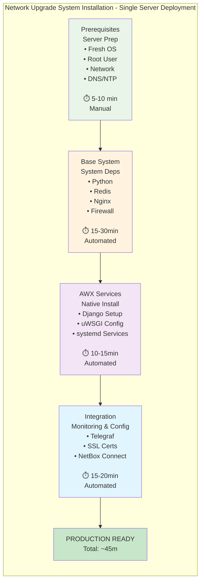

# Installation Guide

Complete installation guide for the Network Device Upgrade Management System. This guide covers single server deployment with native systemd services for AWX and NetBox, optimized for 1000+ device management.

## System Requirements

### Minimum Hardware Requirements
- **CPU**: 4 cores minimum (8 cores recommended)
- **RAM**: 8GB minimum (16GB recommended)  
- **Storage**: 100GB minimum (500GB recommended for firmware storage)
- **Network**: Reliable connectivity to all managed devices

### Supported Operating Systems
- **RHEL/CentOS**: 8.0 or higher
- **Ubuntu**: 20.04 LTS or higher
- **Rocky Linux**: 8.0 or higher
- **AlmaLinux**: 8.0 or higher

### Network Requirements
- **Management Access**: SSH access to all target network devices
- **Internet Access**: Required for downloading packages and firmware
- **DNS Resolution**: Proper DNS configuration for device hostnames
- **Time Synchronization**: NTP configured for accurate logging

## Pre-Installation Checklist

Before beginning installation, ensure:

- [ ] Fresh server installation with unprivileged user account
- [ ] All system updates applied
- [ ] Firewall rules allow SSH (port 22)
- [ ] DNS resolution working properly
- [ ] NTP synchronization configured
- [ ] Sufficient disk space available
- [ ] Network connectivity to target devices tested

## Development and Testing Setup

For development and testing without physical devices:

### Testing Framework Installation

```bash
# Install Ansible with compatible version
pip install 'ansible>=8.0.0,<10.0.0'

# Install Ansible collections
ansible-galaxy collection install -r ansible-content/collections/requirements.yml --force --ignore-certs

# Install testing dependencies (optional)
pip install molecule 'molecule-plugins[docker]' pytest-testinfra yamllint ansible-lint

# Verify installation
ansible --version
ansible-playbook --syntax-check ansible-content/playbooks/main-upgrade-workflow.yml
```

### Quick Testing Validation

```bash
# Test syntax
ansible-playbook --syntax-check ansible-content/playbooks/main-upgrade-workflow.yml

# Test with mock devices
ansible-playbook -i tests/mock-inventories/all-platforms.yml --check \
  ansible-content/playbooks/main-upgrade-workflow.yml

# Run comprehensive tests
./tests/run-all-tests.sh
```

**For complete testing guide, see**: `tests/TEST_FRAMEWORK_GUIDE.md`

## Installation Process Overview

### Installation Flow Diagram



### Step 1: Download and Prepare

```bash
# Clone the repository
git clone https://github.com/company/network-device-upgrade-system.git
cd network-device-upgrade-system

# Make installation scripts executable
chmod +x install/*.sh

# Verify system requirements
./scripts/system-health.sh
```

### Step 2: Base System Installation

Install the base system components including Python, Redis, and Nginx:

```bash
# Run as unprivileged user
./install/setup-system.sh
```

This script will:
- Detect your operating system and version
- Install required system packages
- Configure the current user environment and directories
- Configure Redis with optimized settings
- Set up Nginx with SSL-ready configuration
- Configure firewall rules
- Create systemd user service templates
- Set up log rotation and cron jobs

**Expected Duration**: 15-30 minutes

### Step 3: AWX Container Deployment

Deploy AWX using rootless Podman container:

```bash
# Run as network-upgrade user (rootless)
su - network-upgrade
podman run -d --name awx \
  -p 8043:8043 \
  -v awx_data:/var/lib/awx \
  -v /opt/network-upgrade/ansible-content:/var/lib/awx/projects/network-automation:Z \
  -e POSTGRES_DB=awx \
  -e POSTGRES_USER=awx \
  -e POSTGRES_PASSWORD=awxpass \
  docker.io/ansible/awx:latest

# Enable lingering for rootless containers to start at boot
loginctl enable-linger network-upgrade

# Create user systemd service for AWX container
./install/create-awx-container-service.sh
```

This will:
- Pull the latest AWX container image
- Create persistent volume for AWX data
- Mount Ansible content directory
- Configure container networking
- Create systemd user service for automatic startup

**Expected Duration**: 10-15 minutes

**Important**: AWX will be available at https://localhost:8043 with default admin/password credentials. Rootless containers run without root privileges for better security.

### Step 4: NetBox Integration Verification

Verify NetBox integration (NetBox is pre-existing):

```bash
# Verify NetBox is accessible
curl -k https://localhost:8000/api/

# Test NetBox API token
export NETBOX_URL="https://localhost:8000"
export NETBOX_TOKEN="your_netbox_token_here"
curl -H "Authorization: Token $NETBOX_TOKEN" \
     -H "Content-Type: application/json" \
     $NETBOX_URL/api/dcim/devices/
```

This will:
- Verify NetBox API connectivity
- Test authentication with existing NetBox instance
- Confirm device inventory access

**Expected Duration**: 5 minutes

**Important**: Obtain NetBox API token from existing NetBox administrator.

### Step 5: Telegraf Configuration

Configure Telegraf for metrics collection and InfluxDB integration:

```bash
# Run as unprivileged user
./install/configure-telegraf.sh
```

You will be prompted for:
- InfluxDB v2 server URL
- InfluxDB authentication token
- Organization name
- Bucket name for metrics

**Expected Duration**: 10-15 minutes

### Step 6: SSL Certificate Setup

Configure SSL certificates for secure web access:

```bash
# Run as unprivileged user
./install/setup-ssl.sh
```

Options available:
- Generate self-signed certificates (default)
- Use existing certificate files
- Configure Let's Encrypt (if server has public DNS)

**Expected Duration**: 5-10 minutes

### Step 7: Service Creation and Startup

Create and start all system services:

```bash
# Run as unprivileged user
./install/create-services.sh
```

This will:
- Enable systemd user services for base components
- Start Redis, AWX container, and Telegraf as user services
- Configure service dependencies
- Verify all services are running
- Test web interface connectivity

**Expected Duration**: 5-10 minutes

### Step 8: AWX Template Configuration

Configure AWX job templates and workflows:

```bash
# Run as network-upgrade user
su - network-upgrade
./scripts/configure-awx-templates.sh
```

This script will:
- Import all job templates
- Create workflow templates
- Set up inventories and credentials
- Configure notification templates
- Test template execution

**Expected Duration**: 15-20 minutes

## Post-Installation Configuration

### 1. Change Default Passwords

**AWX Admin Password**:
```bash
# Access AWX web interface at https://your-server:8043
# Default credentials: admin/password (change immediately)
# Go to Access → Users → admin → Edit to change password
```

**NetBox Integration**:
```bash
# NetBox is pre-existing at https://your-server:8000
# Obtain API token from NetBox administrator
# Configure AWX inventory to use NetBox as source
```

### 2. Configure Device Access Credentials

**SSH Key Setup**:
```bash
# Generate SSH key pair for device access
ssh-keygen -t rsa -b 4096 -f /opt/network-upgrade/config/device_ssh_key -N ""

# Add public key to network devices or use username/password credentials in AWX
```

**AWX Credential Configuration**:
1. Access AWX web interface
2. Navigate to Resources → Credentials
3. Create "Network Device SSH" credential with:
   - Credential Type: Machine
   - Username: Your network device username
   - Password: Your network device password (or SSH key)

### 3. Device Inventory Setup

**NetBox Device Verification**:
```bash
# Verify devices are accessible in NetBox
curl -H "Authorization: Token $NETBOX_TOKEN" \
     $NETBOX_URL/api/dcim/devices/ | jq '.count'

# Check device types and platforms
curl -H "Authorization: Token $NETBOX_TOKEN" \
     $NETBOX_URL/api/dcim/platforms/ | jq '.results[].name'
```

**AWX Inventory Sync**:
1. In AWX, go to Resources → Inventories
2. Create "Network Devices" inventory
3. Add NetBox inventory source with API token
4. Configure sync to pull devices from existing NetBox

**Device-Specific Configuration Notes**:
- **Opengear Devices**: System automatically detects architecture (Legacy CLI vs Modern API)
  - Legacy Models (OM2200, CM7100): SSH access required for CLI automation
  - Modern Models (CM8100, IM7200): API tokens required for REST automation
  - Mixed environments supported with automatic routing

### 4. Firmware Repository Setup

```bash
# Create firmware storage directory
mkdir -p $HOME/network-upgrade/firmware/{cisco,arista,fortinet,metamako,opengear}

# Create Opengear subdirectories for different models
mkdir -p $HOME/network-upgrade/firmware/opengear/{legacy,modern}

# Set proper permissions
chmod 755 $HOME/network-upgrade/firmware

# Create firmware hash files (example)
echo "abc123def456...sha512hash" > /opt/network-upgrade/firmware/cisco/n9000-dk9.10.2.3.F.bin.sha512
```

## Verification and Testing

### 1. Service Status Check

```bash
# Run system health check
/usr/local/bin/network-upgrade-health

# Check individual services
systemctl --user status redis nginx telegraf

# Check AWX container (as network-upgrade user)
su - network-upgrade -c "podman ps | grep awx"
su - network-upgrade -c "podman logs awx"
```

### 2. Web Interface Access

- **AWX**: https://your-server:8043
- **NetBox**: https://your-server:8000 (pre-existing)
- **System Health**: Use `/usr/local/bin/network-upgrade-health`

### 3. Test Device Connectivity

```bash
# Run device health check job template in AWX
# Navigate to Templates → Device Health Check → Launch
# Select a few test devices and run validation
```

**Opengear Architecture Detection Testing**:
```bash
# Test automatic architecture detection for Opengear devices
# Run health check against mixed Opengear environment:
# - Legacy devices (OM2200, CM7100) should show "CLI" method
# - Modern devices (CM8100, IM7200) should show "API" method
# Check job output logs for architecture detection results
```

### 4. Verify Monitoring Integration

```bash
# Check Telegraf metrics collection
systemctl --user status telegraf

# Verify InfluxDB connectivity
telegraf --test --config $HOME/.config/telegraf/telegraf.conf --input-filter influxdb_v2_listener
```

## Troubleshooting Common Issues

### Ansible Compatibility Issues

**Problem**: `ModuleNotFoundError: No module named 'ansible.module_utils.six.moves'`
**Solution**: This occurs with Ansible version incompatibility. Fix with:

```bash
# Clean install compatible Ansible version
pip uninstall ansible ansible-core ansible-base -y
pip install 'ansible>=8.0.0,<10.0.0'

# Install collections with SSL workaround if needed
ansible-galaxy collection install cisco.nxos:8.1.0 cisco.ios:8.0.0 fortinet.fortios:2.3.0 \
  ansible.netcommon:6.1.0 community.network:5.0.0 community.general:8.0.0 --force --ignore-certs

# Verify installation
ansible --version
ansible-galaxy collection list
```

**Problem**: SSL certificate errors during collection installation
**Solution**:
```bash
# Use specific versions with --ignore-certs flag
ansible-galaxy collection install -r ansible-content/collections/requirements.yml --ignore-certs --force
```

### Installation Failures

**Problem**: Package installation fails
**Solution**: 
```bash
# Update package repositories
dnf update -y    # RHEL/CentOS
apt update -y    # Ubuntu

# Clear package cache
dnf clean all    # RHEL/CentOS  
apt clean        # Ubuntu
```

**Problem**: Service startup failures
**Solution**:
```bash
# Check service logs
journalctl -u service-name -f

# Check disk space
df -h

# Check memory usage
free -h
```

### Web Interface Issues

**Problem**: Cannot access AWX web interface
**Solution**:
```bash
# Check AWX container (as network-upgrade user)
su - network-upgrade -c "podman ps | grep awx"
su - network-upgrade -c "podman logs awx"

# Check container networking
su - network-upgrade -c "podman port awx"

# Check firewall
firewall-cmd --list-all   # RHEL/CentOS
ufw status               # Ubuntu
```

**Problem**: SSL certificate errors
**Solution**:
```bash
# Regenerate self-signed certificates
./install/setup-ssl.sh

# Check certificate validity
openssl x509 -in $HOME/.config/network-upgrade/ssl/network-upgrade.crt -text -noout
```

### Container Issues

**Problem**: AWX container issues
**Solution**:
```bash
# Check container status (as network-upgrade user)
su - network-upgrade -c "podman ps -a | grep awx"

# Restart container
su - network-upgrade -c "podman restart awx"

# Check container logs
su - network-upgrade -c "podman logs awx --tail 50"

# Recreate container if needed
su - network-upgrade -c "podman stop awx && podman rm awx"
# Run the container deployment command again as network-upgrade user
```

## Backup and Recovery

### Automated Backups

Daily backups are configured automatically:
```bash
# Backup script location
/usr/local/bin/network-upgrade-backup

# Backup storage location  
/var/backups/network-upgrade/

# Restore script
/usr/local/bin/network-upgrade-restore
```

### Manual Backup

```bash
# Create immediate backup
/usr/local/bin/network-upgrade-backup

# Backup specific components
podman stop awx
podman export awx > $HOME/backups/awx-container-backup.tar
cp -r $HOME/.config/network-upgrade $HOME/backups/
podman start awx
```

## Performance Tuning

### For High Device Count (1000+ devices)

**Increase Connection Limits**:
```bash
# Edit $HOME/.config/network-upgrade/config.yml
performance:
  max_concurrent_jobs: 100
  max_device_connections: 200
  connection_timeout: 45
```

**Optimize AWX Settings**:
```bash
# Edit AWX configuration
# Increase worker processes and memory limits
```

**Database Optimization**:
```bash
# SQLite optimization for high load
# Configure WAL mode and increase cache size
```

## Security Hardening

### 1. SSL/TLS Configuration

- Use strong SSL ciphers and protocols
- Implement proper certificate management
- Enable HTTP Strict Transport Security (HSTS)

### 2. Access Control

- Change all default passwords
- Implement role-based access control in AWX
- Use SSH keys for device authentication
- Regular credential rotation

### 3. System Security

- Keep all packages updated
- Configure proper firewall rules
- Enable system audit logging
- Implement intrusion detection

## Next Steps

After successful installation:

1. **Device Onboarding**: Import your network device inventory into NetBox
2. **Credential Setup**: Configure device access credentials in AWX
3. **Test Upgrades**: Perform test upgrades on non-production devices
4. **Monitoring Setup**: Configure Grafana dashboards for visualization
5. **Process Documentation**: Document your specific upgrade procedures
6. **Staff Training**: Train operations staff on the web interfaces and procedures

For operational procedures, see the [Upgrade Workflow Guide](UPGRADE_WORKFLOW_GUIDE.md) and [Platform Implementation Guide](PLATFORM_IMPLEMENTATION_GUIDE.md).

## Support and Maintenance

### Log Locations
- **System Logs**: `$HOME/.local/share/network-upgrade/logs/`
- **AWX Logs**: `$HOME/.local/share/awx/logs/`
- **NetBox Logs**: `$HOME/.local/share/netbox/logs/`
- **Nginx Logs**: `$HOME/.local/share/nginx/logs/`

### Maintenance Schedule
- **Daily**: Automated backups and health checks
- **Weekly**: Log rotation and cleanup
- **Monthly**: System updates and security patches
- **Quarterly**: Full system backup verification

### Getting Help
- Check system health with `/usr/local/bin/network-upgrade-health`
- Examine log files in `$HOME/.local/share/network-upgrade/logs/`
- Review the [Platform Implementation Guide](PLATFORM_IMPLEMENTATION_GUIDE.md) for platform-specific issues
- See the [Documentation Hub](README.md) for comprehensive documentation