# Network Device Upgrade Workflow Guide

This document provides comprehensive workflow diagrams and detailed explanations of the upgrade process architecture.

## Phase-Separated Upgrade Overview

The system implements a **three-phase upgrade approach** designed for operational safety and business continuity:

```mermaid
graph LR
    subgraph "Phase 1: Image Loading 🕐"
        A1[Health Check]
        A2[Storage Cleanup]
        A3[Image Transfer]
        A4[Hash Verification]
        A1 --> A2 --> A3 --> A4
    end
    
    subgraph "Phase 2: Installation 🔒"
        B1[Pre-Install Check]
        B2[Image Activation]
        B3[Device Reboot]
        B4[Recovery Monitor]
        B1 --> B2 --> B3 --> B4
    end
    
    subgraph "Phase 3: Validation ✅"
        C1[Network State]
        C2[Protocol Check]
        C3[Baseline Compare]
        C4[Auto Rollback]
        C5[Metrics Export]
        C1 --> C2 --> C3 --> C4
        C3 --> C5
    end
    
    A4 --> B1
    B4 --> C1
    
    style A1 fill:#e8f5e8
    style B1 fill:#fff3e0
    style C1 fill:#f3e5f5
```

**Phase Summary:**
- **Phase 1** 🕐: Business Hours Safe (No Downtime, Parallelizable)
- **Phase 2** 🔒: Maintenance Window (Planned Downtime, Sequential)
- **Phase 3** ✅: Validation & Recovery (Validation Time, Observable)

## Detailed Workflow State Machine

**Key Decision Points:**
1. **Phase 0 → Phase 1**: Parameter validation and connectivity checks
2. **Phase 1 → Phase 2**: Maintenance window approval required
3. **Phase 2 → Phase 3**: Installation success verification
4. **Any Phase → Rollback**: Failure triggers or manual intervention

## Platform-Specific Workflow Variations

### Cisco NX-OS ISSU Flow

**ISSU Decision Matrix:**
- ✅ **ISSU Capable**: Non-disruptive, faster recovery
- ⚠️ **EPLD Required**: Additional reboot cycle needed
- 🔄 **Disruptive**: Traditional upgrade with full reboot

### Cisco IOS-XE Mode Detection

**Mode Selection Criteria:**
- 🚀 **Install Mode**: Preferred for modern platforms, faster, safer
- 🔄 **Bundle Mode**: Fallback for legacy platforms or unsupported install mode
- 📊 **Storage Check**: Ensures sufficient space for selected method

## Error Handling and Rollback Flows

### Automatic Rollback Triggers

## Validation Framework Architecture

### Multi-Layer Validation Strategy

## Metrics and Observability Flow

### Real-Time Monitoring Pipeline

```mermaid
flowchart TD
    ND[🌐 Network Devices] --> AT[📋 Ansible Validation Tasks]

    AT --> SDP[🔄 Structured Data Processing]
    AT --> LS[💾 Local Storage]

    SDP --> IE[📊 InfluxDB Export]
    LS --> AJL[📄 AWX Job Logs]

    IE --> GD[📈 Grafana Dashboards]
    AJL --> GD

    subgraph "Ansible Tasks"
        AT1[Command Execution]
        AT2[Output Capture]
        AT3[State Analysis]
        AT4[Error Detection]
    end

    subgraph "Data Processing"
        SDP1[JSON Parsing]
        SDP2[Data Validation]
        SDP3[Metric Generation]
        SDP4[Tagging Strategy]
    end

    subgraph "Local Storage"
        LS1[Baseline Files]
        LS2[Comparison Data]
        LS3[Audit Logs]
        LS4[Error Context]
    end

    subgraph "InfluxDB Export"
        IE1[Line Protocol]
        IE2[Time Series]
        IE3[Device Tags]
        IE4[Status Metrics]
    end

    subgraph "AWX Job Logs"
        AJL1[Execution History]
        AJL2[Debug Information]
        AJL3[Performance Data]
        AJL4[User Actions]
    end

    subgraph "Grafana Dashboards"
        GD1[Real-time Views]
        GD2[Alert Rules]
        GD3[Trend Analysis]
        GD4[Executive Reports]
    end

    AT -.-> AT1
    AT -.-> AT2
    AT -.-> AT3
    AT -.-> AT4

    SDP -.-> SDP1
    SDP -.-> SDP2
    SDP -.-> SDP3
    SDP -.-> SDP4

    LS -.-> LS1
    LS -.-> LS2
    LS -.-> LS3
    LS -.-> LS4

    IE -.-> IE1
    IE -.-> IE2
    IE -.-> IE3
    IE -.-> IE4

    AJL -.-> AJL1
    AJL -.-> AJL2
    AJL -.-> AJL3
    AJL -.-> AJL4

    GD -.-> GD1
    GD -.-> GD2
    GD -.-> GD3
    GD -.-> GD4

    style ND fill:#f9f9f9,stroke:#333,stroke-width:2px
    style AT fill:#e8f5e8,stroke:#4caf50,stroke-width:2px
    style SDP fill:#fff3e0,stroke:#ff9800,stroke-width:2px
    style IE fill:#e3f2fd,stroke:#2196f3,stroke-width:2px
    style GD fill:#f3e5f5,stroke:#9c27b0,stroke-width:2px
```

## Operational Safety Features

### Built-in Safety Mechanisms

```mermaid
flowchart TD
    subgraph OSF["🛡️ OPERATIONAL SAFETY FRAMEWORK"]
        subgraph PREV["🔍 PREVENTION"]
            PC[PRE-CHECKS]
            PC --> PCD[Prevention Details]

            subgraph "Pre-Check Items"
                PC1[• Permissions]
                PC2[• Connectivity]
                PC3[• Disk Space]
                PC4[• Image Hash]
                PC5[• Dependencies]
                PC6[• Maintenance]
                PC7[• Approval]
            end

            PCD --> GK[GATE KEEPER<br/>APPROVAL]
        end

        subgraph DET["🔍 DETECTION"]
            MON[MONITORING]
            MON --> MD[Monitoring Details]

            subgraph "Monitoring Items"
                MON1[• Connectivity]
                MON2[• Protocol]
                MON3[• Performance]
                MON4[• Error Rate]
                MON5[• Response]
                MON6[• Health]
                MON7[• Compliance]
            end

            MD --> RT[REAL-TIME<br/>TELEMETRY]
        end

        subgraph REC["🔄 RECOVERY"]
            RB[ROLLBACK]
            RB --> RBD[Recovery Details]

            subgraph "Recovery Items"
                RB1[• Auto Restore]
                RB2[• Config Revert]
                RB3[• Image Revert]
                RB4[• Boot Repair]
                RB5[• Network Fix]
                RB6[• Service Heal]
                RB7[• Alert Notify]
            end

            RBD --> RV[RECOVERY<br/>VALIDATION]
        end
    end

    PC --> MON
    MON --> RB

    PCD -.-> PC1
    PCD -.-> PC2
    PCD -.-> PC3
    PCD -.-> PC4
    PCD -.-> PC5
    PCD -.-> PC6
    PCD -.-> PC7

    MD -.-> MON1
    MD -.-> MON2
    MD -.-> MON3
    MD -.-> MON4
    MD -.-> MON5
    MD -.-> MON6
    MD -.-> MON7

    RBD -.-> RB1
    RBD -.-> RB2
    RBD -.-> RB3
    RBD -.-> RB4
    RBD -.-> RB5
    RBD -.-> RB6
    RBD -.-> RB7

    style OSF fill:#f9f9f9,stroke:#333,stroke-width:3px
    style PREV fill:#e8f5e8,stroke:#4caf50,stroke-width:2px
    style DET fill:#fff3e0,stroke:#ff9800,stroke-width:2px
    style REC fill:#ffebee,stroke:#f44336,stroke-width:2px
    style PC fill:#c8e6c9
    style MON fill:#ffcc80
    style RB fill:#ffcdd2
    style GK fill:#a5d6a7
    style RT fill:#ffb74d
    style RV fill:#ef9a9a
```

This comprehensive workflow guide provides the visual foundation for understanding the system's operational approach, safety mechanisms, and platform-specific variations.