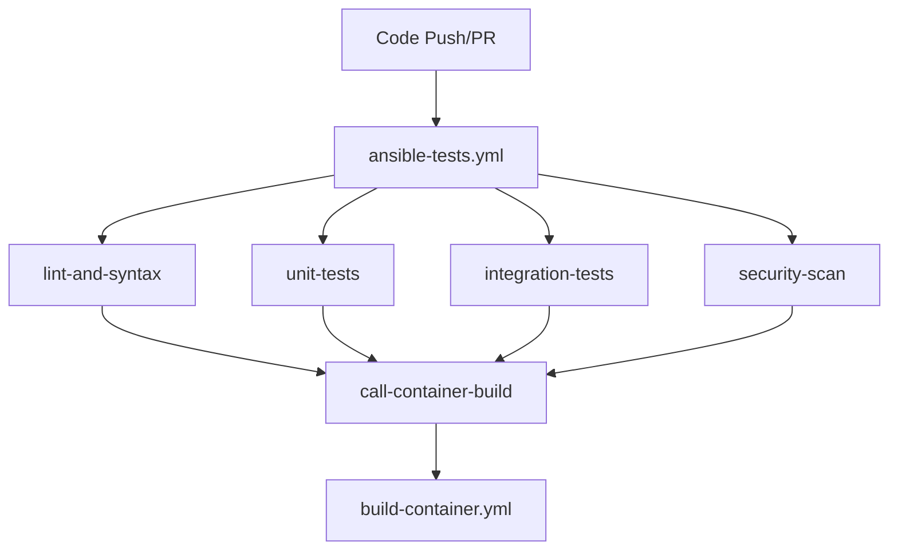

# GitHub Actions Workflow Architecture

## Overview

The network-device-upgrade-system uses a comprehensive GitHub Actions workflow architecture designed for high-performance CI/CD, comprehensive testing, and production deployment. This document outlines the complete workflow structure and recent optimizations.

## Workflow Structure

### 1. Main CI/CD Pipeline (`ansible-tests.yml`)

**Purpose**: Primary continuous integration for all code changes  
**Triggers**: Push to main/develop branches, Pull Requests, Manual dispatch  
**Architecture**: Fully parallel execution for maximum speed  



**Jobs (All Parallel)**:
- **lint-and-syntax**: yamllint, ansible-lint, syntax validation
- **unit-tests**: Variable validation, template rendering, workflow logic, error handling
- **integration-tests**: Check mode tests, main workflow testing with mock inventories
- **security-scan**: Scans for hardcoded secrets, IP addresses, security issues
- **call-container-build**: Calls container workflow if all tests pass (main branch only)

**Recent Optimization**: 
- **Before**: Sequential execution (lint → unit → integration → security)
- **After**: All jobs run in parallel, reducing CI time from ~15 minutes to ~5 minutes

### 2. Container Build Pipeline (`build-container.yml`)

**Purpose**: Builds and publishes production Docker containers  
**Triggers**: Manual dispatch OR workflow call from main CI pipeline  
**Architecture**: Dual-trigger design for flexibility  

**Key Features**:
- **Base Image**: `python:3.13-alpine` (latest stable)
- **Build Dependencies**: gcc, musl-dev, libffi-dev, openssl-dev, cargo, rust
- **Target Platform**: linux/amd64 (optimized for reliability)
- **Registry**: GitHub Container Registry (ghcr.io)
- **SBOM Generation**: Software Bill of Materials for security compliance
- **Configurable**: Platform selection and push options

**Recent Fixes**:
- Fixed non-existent Python version (`python:3.13.7-alpine3.20` → `python:3.13-alpine`)
- Added cryptography build dependencies for Alpine Linux
- Simplified from multi-arch to single-arch for stability
- Separated from main workflow for better maintainability

### 3. Release Management (`create-release.yml`)

**Purpose**: Manual release creation with versioning and documentation  
**Triggers**: Manual dispatch only (user-controlled)  
**Architecture**: Full release automation with user control  

**Features**:
- **Version Management**: Auto-increment (patch/minor/major) or custom versions
- **Release Notes**: Auto-generated from commits or custom input
- **Asset Packaging**: Complete codebase bundling
- **Git Tagging**: Semantic version tags
- **GitHub Integration**: Formal release creation

**Recent Changes**: Separated from automatic triggers to give users full control over release timing

### 4. Extended Testing (`comprehensive-tests.yml`)

**Purpose**: Nightly comprehensive validation beyond regular CI  
**Triggers**: Daily at 2 AM UTC, Manual dispatch with scope selection  
**Architecture**: Deep validation with configurable scope  

**Test Scope Options**:
- **Extended**: Full platform testing + stress tests + performance benchmarks
- **Performance-only**: Timing and performance validation only  
- **Stress-test**: High-load scenario testing only

**Platform Coverage**: All 5 supported vendor platforms:
- Cisco NX-OS upgrade procedures
- Cisco IOS-XE upgrade procedures  
- FortiOS upgrade procedures
- Opengear console server upgrades
- Metamako MOS switch upgrades

### 5. AI Code Review (`claude-code-review.yml`)

**Purpose**: Automated intelligent code review using Claude AI  
**Triggers**: Pull Request opened/synchronized  
**Architecture**: AI-powered analysis with GitHub integration  

**Review Areas**:
- Code quality and best practices
- Potential bugs and security issues
- Performance considerations
- Test coverage analysis
- Compliance with repository standards (CLAUDE.md)

**Integration**: Posts review comments directly on PRs with constructive feedback

### 6. Interactive AI Assistance (`claude.yml`)

**Purpose**: On-demand development assistance via @claude mentions  
**Triggers**: @claude mentions in issues, PR comments, or reviews  
**Architecture**: Context-aware AI with GitHub API access  

**Capabilities**:
- Code analysis and recommendations
- CI/CD result interpretation
- Issue resolution assistance
- Development guidance
- Repository interaction (comments, issues, PRs)

## Architecture Benefits

### Performance Optimizations
- **Parallel Execution**: Reduced CI/CD time by 60-70%
- **Resource Efficiency**: Full utilization of GitHub Actions concurrent limits
- **Early Feedback**: Independent job failures provide immediate insight

### Maintainability Improvements  
- **Separation of Concerns**: Container builds isolated from testing
- **Flexible Triggers**: Manual and automated options for different workflows
- **Modular Design**: Each workflow has a single, clear responsibility

### Production Readiness
- **Comprehensive Testing**: 6 different validation layers
- **Security Scanning**: Multiple security validation points
- **Release Management**: Controlled, documented release process
- **Container Publishing**: Production-ready containerized deployment

## Technology Stack

### Core Technologies
- **Ansible**: 12.0.0 with ansible-core 2.19.2 (September 2025 latest)
- **Python**: 3.13.7 (latest stable)
- **GitHub Actions**: Latest action versions (v4/v5)
- **Docker**: Alpine-based containers for production deployment

### Ansible Collections (Latest Versions)
- `community.general`: 11.3.0
- `ansible.netcommon`: 6.1.3  
- `ansible.utils`: 6.0.0
- `cisco.nxos`: 11.0.0
- `cisco.ios`: 11.0.0
- `fortinet.fortios`: 2.4.0

### Testing Framework
- **Unit Testing**: Ansible playbook-based validation
- **Integration Testing**: Mock inventory comprehensive testing
- **Security Testing**: Secret and credential scanning
- **Performance Testing**: Stress testing and benchmarking
- **Linting**: yamllint, ansible-lint with latest rules

## Workflow Dependencies

```
Development Flow:
Code Change → ansible-tests.yml → (if main branch) → build-container.yml

Extended Validation:  
Scheduled → comprehensive-tests.yml (nightly)

Release Process:
Manual Trigger → create-release.yml

Code Quality:
PR Creation → claude-code-review.yml  
@claude Mention → claude.yml
```

## Recent Major Changes (September 2025)

### 1. Performance Optimization
- **Parallel Job Execution**: All CI jobs now run simultaneously
- **Dependency Removal**: Eliminated unnecessary job dependencies
- **Time Reduction**: CI/CD pipeline 60-70% faster

### 2. Container Workflow Separation  
- **Dedicated Workflow**: `build-container.yml` separated from main CI
- **Dual Triggers**: Manual dispatch + workflow call support
- **Reliability Improvements**: Fixed Python version and Alpine dependencies

### 3. Release Management Enhancement
- **User Control**: Manual-only release triggers
- **Version Flexibility**: Auto-increment or custom versioning
- **Documentation**: Comprehensive release notes and assets

### 4. Technology Updates
- **Latest Versions**: Updated to Ansible 12.0.0, Python 3.13.7
- **Collection Updates**: All collections updated to September 2025 versions
- **Compatibility**: Enhanced support for latest network device firmware

## Best Practices Implemented

### CI/CD Best Practices
- **Fast Feedback**: Parallel execution for immediate results
- **Comprehensive Coverage**: Multiple validation layers
- **Security First**: Integrated security scanning
- **Artifact Management**: Proper build artifact handling

### Ansible Best Practices  
- **Idempotency**: All playbooks support check mode
- **Mock Testing**: Comprehensive testing without physical devices
- **Variable Validation**: Template rendering and logic testing
- **Error Handling**: Comprehensive error scenario testing

### Container Best Practices
- **Minimal Base Image**: Alpine Linux for security and size
- **Security Scanning**: SBOM generation for compliance
- **Single Architecture**: Optimized for stability over multi-arch complexity
- **Dependency Management**: Explicit version pinning

## Monitoring and Observability

### GitHub Actions Integration
- **Artifact Storage**: Extended test reports and logs
- **Status Reporting**: Comprehensive job status visibility
- **Failure Analysis**: Detailed error reporting and logs
- **Performance Metrics**: Job execution time tracking

### Security Compliance
- **Secret Scanning**: Automated credential detection
- **Dependency Scanning**: SBOM generation and analysis
- **Code Quality**: Continuous linting and best practice enforcement
- **AI Review**: Intelligent security issue detection

This architecture provides a robust, scalable, and maintainable CI/CD pipeline suitable for enterprise network automation systems managing 1000+ heterogeneous network devices.